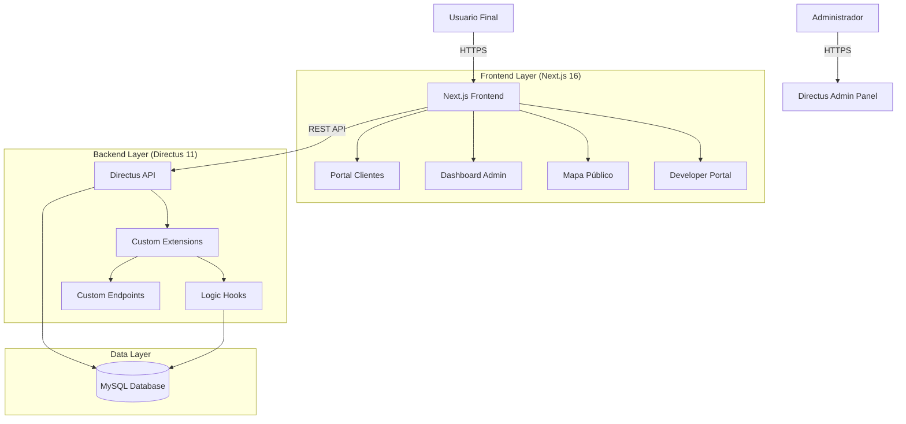

# Documentación Integral del Proyecto Quintas-CRM (Versión 2.0)

**Fecha de Actualización:** 5 de Febrero de 2026  
**Estado:** Fase 4 (Auditoría) / Fase 5 (Inicio)  
**Versión de Documentación:** 2.0

---

## 1. Visión General del Proyecto

Quintas-CRM es un ERP Inmobiliario diseñado para la gestión integral de desarrollos campestres. El sistema administra el ciclo de vida completo de la venta de terrenos: desde la gestión de inventario (lotes) y clientes, hasta la formalización de ventas, generación de tablas de amortización, control de pagos y cálculo de comisiones.

### Stack Tecnológico Actualizado
*   **Backend:** Directus Headless CMS (v11.14.0) corriendo en Node.js.
*   **Base de Datos:** MySQL 8.0 (Gestionada por Directus + Schema personalizado).
*   **Frontend:** Next.js 16.1 (App Router) + React Server Components.
*   **Lenguaje:** TypeScript / JavaScript (Node.js).
*   **Autenticación:** NextAuth.js v5 (Beta) con integración personalizada a Directus.
*   **Infraestructura:** Docker (Desarrollo), Node.js nativo (Producción/Testing).

---

## 2. Arquitectura del Sistema

### 2.1 Diagrama de Alto Nivel
El sistema sigue una arquitectura "Headless" donde Directus actúa como el backend unificado (API + Admin Panel + Database Manager) y Next.js provee las interfaces de usuario especializadas.



### 2.2 Sistema de Autenticación (Actualizado)
**Referencia de Código:** [`frontend/lib/auth.ts`](file:///c%3A/Users/nadir/quintas-crm/frontend/lib/auth.ts)

La autenticación es híbrida y robusta:
1.  **Proveedor:** `NextAuth.js v5` usando `CredentialsProvider`.
2.  **Backend:** Valida credenciales contra el endpoint `/auth/login` de Directus.
3.  **Sesión:** JWT enriquecido con datos del usuario (`role`, `clienteId`, `vendedorId`).
4.  **Optimización:** Uso de agentes HTTP/HTTPS con `keepAlive: true` para reducir latencia en la comunicación interna Server-to-Server.
5.  **Seguridad:** Middleware en Next.js protege rutas `/portal` y `/dashboard` basándose en roles.

### 2.3 Modelo de Datos Core (CRM)
El esquema de base de datos (`database/migrations/`) incluye las siguientes entidades principales:
*   **Lotes:** Inventario con estatus (disponible, apartado, vendido).
*   **Clientes:** Información de contacto y fiscal.
*   **Vendedores:** Perfiles de agentes y esquemas de comisión.
*   **Ventas:** Transacción principal que vincula Cliente-Lote-Vendedor.
*   **Pagos:** Registro de ingresos, vinculados a Ventas.
*   **Amortizaciones:** Proyecciones de pagos futuros generadas automáticamente.

---

## 3. Estado de Módulos y Extensiones

El backend ha sido extendido con lógica de negocio personalizada en `extensions/`. A continuación, el estado de los módulos críticos:

### 3.1 Extensiones Activas (Backend)

| Extensión | Tipo | Estado | Descripción Técnica |
|-----------|------|--------|---------------------|
| `endpoint-pagos` | Endpoint | ✅ Activo | API para gestión de pagos con validación Zod y Rate Limiting. |
| `comisiones` | Endpoint | ✅ Activo | Calculadora de comisiones `/comisiones/calcular` basada en ventas. |
| `crm-logic` | Hook | ✅ Activo | Reglas de negocio: impide venta de lotes no disponibles, auto-aparta lotes. |
| `amortizacion` | Endpoint | ✅ Activo | Generador de tablas de amortización (Francés/Global). |
| `ventas-api` | Endpoint | ✅ Activo | API especializada para creación compleja de ventas. |
| `clientes` | Endpoint | ✅ Activo | Gestión de perfiles de clientes. |

### 3.2 Módulos Frontend

| Módulo | Ruta | Estado | Descripción |
|--------|------|--------|-------------|
| **Auth** | `/login`, `/api/auth` | ✅ Completo | Login unificado, manejo de sesiones, recuperación de password. |
| **Dashboard** | `/dashboard` | 🟡 En Auditoría | Visualización de KPIs, reportes de ventas y pagos. |
| **Portal Clientes** | `/portal` | 🔵 En Inicio | (Fase 5) Vistas de estado de cuenta y documentos. |
| **Mapa** | `/mapa` | ✅ Completo | Visualización SVG interactiva de lotes. |

---

## 4. Estrategia de Desarrollo y Roadmap Actualizado

El proyecto se rige por una serie de documentos maestros ("Prompts Maestros") que definen la ejecución de cada fase.

### Fases Completadas (1-3)
*   Configuración base, Base de datos, Lógica core de CRM.

### Fase 4: Dashboards y Reportes (🟡 En Auditoría)
*   **Objetivo:** Visualización de datos para toma de decisiones.
*   **Estado:** Implementación técnica finalizada. Pendiente validación formal.
*   **Acción Requerida:** Ejecutar `PROMPT_AUDITORIA_VALIDACION_FASES.md`.

### Fase 5: Portal de Clientes (🔵 Próxima)
*   **Documento Maestro:** [`PROMPTS_FASE_5_OPTIMIZADOS.md`](file:///c%3A/Users/nadir/quintas-crm/RetornoDeProyecto/v2/PROMPTS_FASE_5_OPTIMIZADOS.md)
*   **Objetivo:** Autogestión para clientes (ver pagos, descargar recibos).
*   **Estrategia:** Sprint 5.1 (Seguridad/Auth) y Sprint 5.2 (Funcionalidad).

### Fase 6: Integraciones (⚪ Pendiente)
*   Integración futura con pasarelas de pago y facturación.

### Fase 7: Testing Automatizado (🟣 Nuevo)
*   **Documento Maestro:** [`PROMPTS_MAE_FASES_7_8.md`](file:///c%3A/Users/nadir/quintas-crm/RetornoDeProyecto/v2/PROMPTS_MAE_FASES_7_8.md)
*   **Objetivo:** Cobertura de código > 80% (Jest para Backend, Playwright para E2E).

### Fase 8: Deployment & Ops (🟣 Nuevo)
*   **Documento Maestro:** [`PROMPTS_MAE_FASES_7_8.md`](file:///c%3A/Users/nadir/quintas-crm/RetornoDeProyecto/v2/PROMPTS_MAE_FASES_7_8.md)
*   **Objetivo:** CI/CD, Monitoreo y puesta en producción.

---

## 5. Guía Técnica para Desarrolladores

### 5.1 Ubicación de Código Clave
*   **Configuración Auth:** [`frontend/lib/auth.ts`](file:///c%3A/Users/nadir/quintas-crm/frontend/lib/auth.ts)
*   **Middleware Frontend:** [`frontend/middleware.ts`](file:///c%3A/Users/nadir/quintas-crm/frontend/middleware.ts) (Si existe, o en configuración de NextAuth).
*   **Lógica de Pagos (Backend):** [`extensions/endpoint-pagos/src/index.js`](file:///c%3A/Users/nadir/quintas-crm/extensions/endpoint-pagos/src/index.js)
*   **Reglas de Negocio (Backend):** [`extensions/directus-extension-hook-crm-logic/src/index.js`](file:///c%3A/Users/nadir/quintas-crm/extensions/directus-extension-hook-crm-logic/src/index.js)

### 5.2 Comandos Útiles

**Backend (Directus):**
```bash
cd extensions/endpoint-pagos
npm install
# Para iniciar Directus (desde raíz)
npx directus start
```

**Frontend (Next.js):**
```bash
cd frontend
npm run dev      # Servidor de desarrollo
npm run lint     # Verificación de código
npm run test:e2e # Pruebas con Playwright
```

### 5.3 Convenciones
*   **Idioma:** Comentarios en ESPAÑOL, Código (variables/funciones) en INGLÉS.
*   **Commits:** Conventional Commits (feat, fix, docs, style, refactor).
*   **Validación:** Siempre validar inputs en Backend (Zod) y Frontend.

---

## 6. Cambios Recientes (Log)

*   **[2026-02-05] Actualización de Documentación:** Creación de `DOCUMENTACION_INTEGRAL_V2.md` y `DOCUMENTACION_CAMBIOS_RECIENTES.md`.
*   **[2026-02-05] Backend Refactor:** Implementación de Rate Limiting en `endpoint-pagos` y lógica anti-doble venta en `crm-logic`.
*   **[2026-02-03] Roadmap Update:** Inclusión de Fases 7 y 8 para asegurar calidad y despliegue.
*   **[2026-01-31] Fase 5 Strategy:** Optimización de estrategia de autenticación con NextAuth v5.

---

## 7. Recursos Adicionales

*   [Documentación de Cambios Recientes](file:///c%3A/Users/nadir/quintas-crm/RetornoDeProyecto/v2/DOCUMENTACION_CAMBIOS_RECIENTES.md)
*   [Plan de Pruebas (Fase 7)](file:///c%3A/Users/nadir/quintas-crm/RetornoDeProyecto/v2/PROMPTS_MAE_FASES_7_8.md)
*   [Protocolo de Auditoría](file:///c%3A/Users/nadir/quintas-crm/RetornoDeProyecto/v2/PROMPT_AUDITORIA_VALIDACION_FASES.md)
