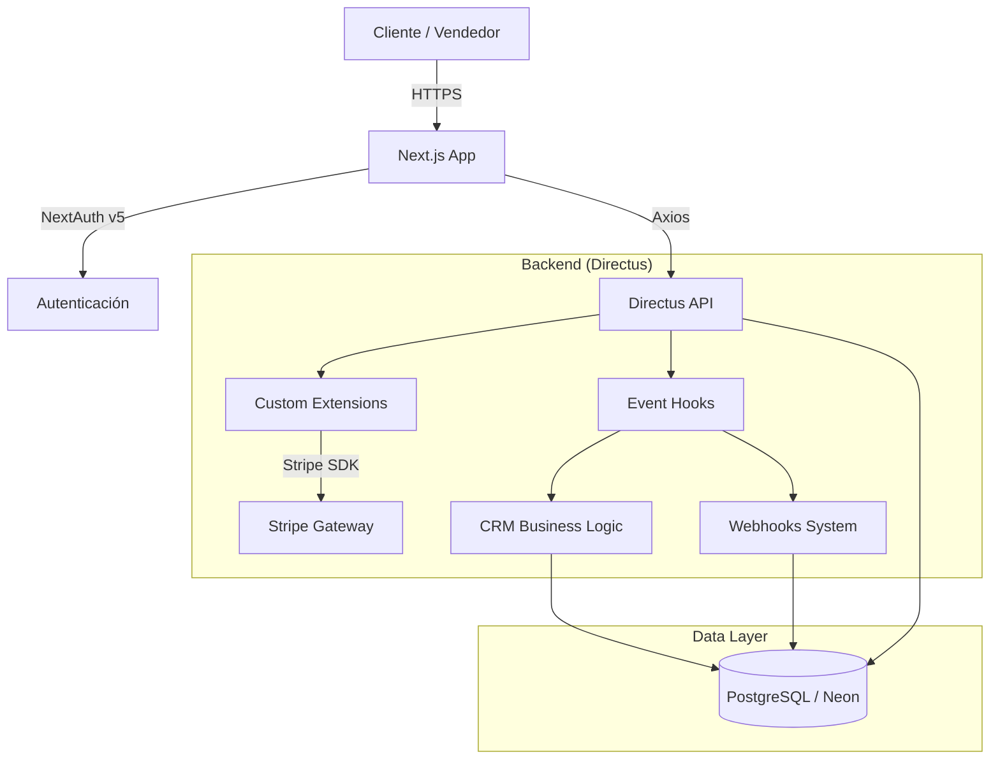

# Documentación Técnica Maestra - Quintas CRM

**Versión:** 2.1.0
**Fecha de Actualización:** 2026-02-10
**Estado:** Vigente
**Clasificación:** Confidencial - Uso Interno Exclusivo

---

## Índice

1. [Stack Tecnológico](#1-stack-tecnológico)
2. [Alcances del Proyecto](#2-alcances-del-proyecto)
3. [Catálogo de Módulos (Backend)](#3-catálogo-de-módulos-backend)
4. [Catálogo de Funciones Core (Frontend)](#4-catálogo-de-funciones-core-frontend)
5. [Documentación de Implementaciones Críticas](#5-documentación-de-implementaciones-críticas)
6. [Glosario y Anexos](#6-glosario-y-anexos)

---

## 1. Stack Tecnológico

### 1.1 Resumen de Tecnologías

| Capa | Tecnología | Versión | Justificación Técnica |
|------|------------|---------|-----------------------|
| **Frontend** | Next.js | 16.1.6 | Framework React para SSR/SSG, optimización de imágenes y routing avanzado. |
| **Auth** | NextAuth.js | 5.0.0-beta.30 | Manejo de sesiones seguro, compatible con React Server Components (RSC). |
| **UI Library** | React | 18.3.1 | Librería estándar para interfaces dinámicas y reutilizables. |
| **Backend** | Directus | 11.14.0 | Headless CMS + BaaS. Proporciona API REST instantánea y gestión de contenidos. |
| **Database** | PostgreSQL | (Neon DB) | Base de datos relacional robusta y escalable (Serverless). |
| **Pagos** | Stripe SDK | 20.3.0 | Procesamiento seguro de pagos y cumplimiento PCI-DSS. |
| **Validación** | Zod | 4.x | Validación de esquemas en tiempo de ejecución (Runtime Type Checking). |
| **Cliente HTTP**| Axios | 1.13.4 | Cliente HTTP basado en promesas con soporte de interceptores. |

### 1.2 Arquitectura del Sistema

El sistema sigue una arquitectura **Headless Desacoplada** donde el Frontend (Next.js) consume servicios del Backend (Directus) vía API REST.



---

## 2. Alcances del Proyecto

### 2.1 Objetivos del Sistema
Desarrollar un ERP/CRM especializado para el sector inmobiliario (Quintas) que centralice la gestión de inventario (lotes), ventas, cobranza y comisiones, asegurando la integridad de datos y cumplimiento normativo.

### 2.2 Alcance Funcional
*   **Gestión de Inventario:** CRUD de lotes, mapas interactivos, estados (disponible, apartado, vendido).
*   **Gestión Comercial:** Pipeline de ventas, asignación de vendedores, cálculo de comisiones.
*   **Cobranza:** Generación de planes de pago, amortización, integración con Stripe.
*   **Portal de Clientes:** Visualización de estado de cuenta, descargas de recibos.
*   **Integraciones:** Webhooks para sistemas externos y Developer Portal.

---

## 3. Catálogo de Módulos (Backend)

El backend se extiende mediante **18 Extensiones de Directus** ubicadas en `/extensions`.

### 3.1 Módulos de Negocio Core

| Módulo | Tipo | Descripción y Responsabilidad |
|--------|------|-------------------------------|
| `directus-extension-hook-crm-logic` | **Hook** | **CRÍTICO.** Valida reglas invariantes (Anti-doble venta). Bloquea transacciones que violen la integridad del inventario. |
| `directus-endpoint-lotes` | **Endpoint** | Gestión especializada de lotes (inventario). |
| `ventas-api` | **Endpoint** | API transaccional para creación y gestión de contratos de venta. |
| `clientes` | **Endpoint** | Gestión de perfiles de clientes y sus relaciones. |
| `vendedores` | **Endpoint** | Gestión de fuerza de ventas y asignaciones. |
| `perfil` | **Endpoint** | Endpoint "Me" enriquecido para usuarios del portal. |

### 3.2 Módulos Financieros

| Módulo | Tipo | Descripción y Responsabilidad |
|--------|------|-------------------------------|
| `endpoint-pagos` | **Endpoint** | **Pasarela de Pagos.** Integra Stripe, valida montos, y aplica Rate Limiting (100 req/min). |
| `comisiones` | **Endpoint** | Cálculo de comisiones para vendedores (reglas fijas/variables). |
| `amortizacion` | **Endpoint** | Generador de tablas de amortización (proyección de pagos). |

### 3.3 Módulos de Funcionalidad Avanzada

| Módulo | Tipo | Descripción y Responsabilidad |
|--------|------|-------------------------------|
| `mapa-lotes` | **Endpoint** | Generador de GeoJSON optimizado para visualización de mapas. |
| `crm-analytics` | **Endpoint** | Agregación de datos para KPIs y Dashboards (Ventas por mes, etc). |
| `webhooks-subscriptions` | **Endpoint** | API para que sistemas externos se suscriban a eventos (requiere OAuth). |
| `webhooks-trigger` | **Hook** | **Sistema de Eventos.** Detecta cambios (`venta.created`, `pago.completed`) y encola notificaciones. Incluye Cron Job de entrega. |

### 3.4 Infraestructura y Desarrollo

| Módulo | Tipo | Descripción y Responsabilidad |
|--------|------|-------------------------------|
| `api-docs` | **Endpoint** | Documentación automática de la API (Swagger/OpenAPI). |
| `developer-portal` | **Endpoint** | Backend para el portal de desarrolladores externos. |
| `custom-oauth` | **Endpoint** | Proveedor OAuth 2.0 Mock para pruebas de integración y flujos de autorización. |
| `middleware` | **Lib** | Librerías compartidas (ej. `oauth-auth.mjs`) usadas por otras extensiones. |
| `test-endpoint` | **Endpoint** | Endpoint de diagnóstico y health-check. |

---

## 4. Catálogo de Funciones Core (Frontend)

Ubicadas principalmente en `frontend/lib` y `frontend/app/api`.

### 4.1 Sistema de Autenticación (`frontend/lib/auth.ts`)
Implementación de **NextAuth v5** con `CredentialsProvider` personalizado.
*   **Login:** Autentica contra Directus (`/auth/login`).
*   **Session:** Enriquece el JWT con `role`, `id` y `access_token` de Directus.
*   **Refresh:** Maneja la rotación de tokens automáticamente.
*   **Keep-Alive:** Configuración optimizada de Agente HTTP para conexiones persistentes.

### 4.2 Clientes API (`frontend/lib/*-api.ts`)
Colección de clientes tipados para cada dominio:
*   `directus-api.ts`: Cliente base Axios con interceptores de Auth.
*   `pagos-api.ts`: Métodos para crear Intents de Stripe y registrar pagos.
*   `dashboard-api.ts`: Consumo de endpoints de analítica (`crm-analytics`).
*   `documentos-api.ts`: Manejo de descargas de archivos/recibos.

### 4.3 API Routes (Backend-for-Frontend)
Endpoints intermedios en Next.js (`frontend/app/api`) para ocultar lógica o agregar seguridad adicional:
*   `api/dashboard/ventas-por-mes`: Agregación y transformación de datos para gráficas.
*   `api/pagos/[id]`: Proxy seguro para consultas de estado de pago.
*   `api/reportes/recibo-pago`: Generación de PDFs (si aplica) o redirección a archivos seguros.

### 4.4 Sistema SVG (`frontend/lib/svg/`)
*   `svg-mapper.ts`: Mapeo dinámico de coordenadas de lotes a elementos visuales SVG.
*   `svg-utils.ts`: Utilidades para manipulación de paths y viewbox en el mapa interactivo.

---

## 5. Documentación de Implementaciones Críticas

### 5.1 Webhook System (Event Driven Architecture)
**Ubicación:** `extensions/webhooks-trigger`
**Funcionamiento:**
1.  **Captura:** Un hook `action` escucha `ventas.items.create`.
2.  **Encolado:** Crea un registro en `webhooks_delivery_logs` con estado `pending`.
3.  **Procesamiento:** Un Cron Job (schedule) corre cada 30 segundos, busca logs pendientes y los envía a las URLs suscritas (`webhooks_subscriptions`).
**Beneficio:** Desacopla la operación de venta del envío de notificaciones (ej. a Zapier o Slack), evitando que un error de red bloquee la venta.

### 5.2 Validación Anti-Doble Venta
**Ubicación:** `extensions/directus-extension-hook-crm-logic`
**Código Clave:**
```javascript
filter('ventas.items.create', async (payload) => {
  const lote = await database.select('estatus').from('lotes').where('id', payload.lote_id).first();
  if (lote.estatus !== 'disponible') {
    throw new ForbiddenException(`El lote no está disponible (Estatus: ${lote.estatus})`);
  }
  return payload;
});
```
**Importancia:** Previene inconsistencias graves en el inventario.

### 5.3 Rate Limiting en Pagos
**Ubicación:** `extensions/endpoint-pagos`
**Lógica:** Middleware en memoria que rastrea `hits` por IP.
**Límite:** 100 peticiones / minuto.
**Respuesta:** HTTP 429 "Too Many Requests".

---

## 6. Glosario y Anexos

*   **Extension (Directus):** Módulo de código que añade funcionalidad al núcleo de Directus (Endpoint, Hook, Interface).
*   **Hook:** Script que intercepta eventos de base de datos.
*   **Endpoint:** Ruta API personalizada.
*   **NextAuth:** Librería de autenticación para Next.js.
*   **Zod:** Librería de validación de esquemas (usada en `endpoint-pagos`).
*   **Cron Job:** Tarea programada recurrente (usada en `webhooks-trigger`).

---
*Fin del Documento. Generado por Documentation Expert AI.*
