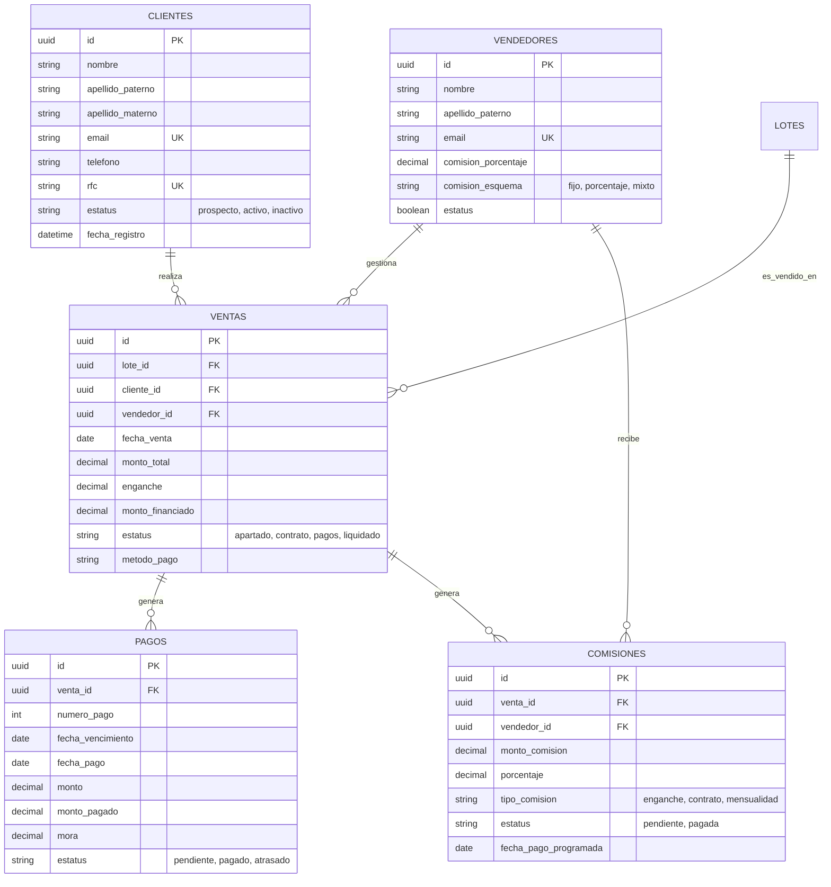

# Diseño de Base de Datos - Módulo CRM y Ventas (Fase 2)

**Versión:** 1.0.0
**Fecha:** 30 Enero 2026
**Responsable:** Database Agent Warrior

## 1. Diagrama Entidad-Relación (ERD)

## 2. Diccionario de Datos

### 2.1. Colección `clientes`
Almacena la información de prospectos y clientes reales.
- **Relaciones:**
    - Uno a Muchos con `ventas` (Un cliente puede comprar múltiples lotes).
- **Índices Clave:**
    - `email` (Unique): Evita duplicados.
    - `rfc` (Unique): Identificador fiscal único.
    - `estatus`: Para filtrado rápido de prospectos vs clientes.

### 2.2. Colección `vendedores`
Personal de ventas y comisionistas externos.
- **Relaciones:**
    - Uno a Muchos con `ventas`.
    - Uno a Muchos con `comisiones`.
- **Reglas de Negocio:**
    - `comision_esquema`: Define cómo se calcula su pago (e.g., 5% fijo o variable según volumen).

### 2.3. Colección `ventas`
Tabla pivote central que vincula Quién (Cliente) compró Qué (Lote) a través de Quién (Vendedor) y Cómo (Condiciones).
- **Foreign Keys:**
    - `lote_id`: Vincula con inventario existente.
    - `cliente_id`: Comprador.
    - `vendedor_id`: Responsable de la venta.
- **Campos Calculados (Backend):**
    - `monto_financiado` = `monto_total` - `enganche`.

### 2.4. Colección `pagos`
Tabla de amortización y registro de ingresos.
- **Flujo:**
    - Al crear una venta financiada, se generan N registros con estatus `pendiente`.
    - Al recibir dinero, se actualiza a `pagado` y se registra `fecha_pago`.
- **Integridad:**
    - `venta_id` con `ON DELETE CASCADE` (Si se borra la venta -por error-, se borran sus pagos).

### 2.5. Colección `comisiones`
Registro de pasivos de la empresa hacia los vendedores.
- **Trigger Lógico:**
    - Se genera automáticamente cuando una `venta` cambia de estatus o cuando un `pago` específico (ej. enganche) es realizado.

## 3. Estrategia de Implementación en Directus

1.  **Creación de Colecciones:** Ejecutar script SQL `database/migrations/001_create_crm_schema.sql` directamente en la base de datos MySQL subyacente de Directus.
2.  **Sincronización:** Una vez creadas las tablas, ir a Directus Admin -> Settings -> Data Model y Directus detectará las nuevas tablas, permitiendo configurarlas como colecciones gestionadas ("System Collections").
3.  **Configuración de UI:** Configurar interfaces (inputs, dropdowns para enums) manualmente en el Admin Panel para mejorar la UX de los operadores.

## 4. Consideraciones de Seguridad
- RLS (Row Level Security) debe configurarse en Directus Roles & Permissions para que:
    - Vendedores solo vean sus propias ventas/comisiones.
    - Administradores vean todo.
