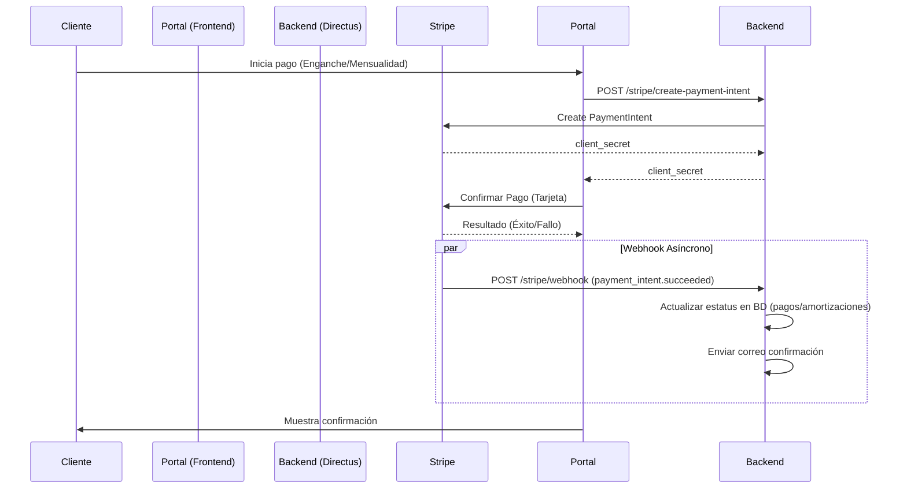

# Guía de Integración de Stripe - Quintas de Otinapa

## 1. Introducción y Objetivos

Esta guía detalla el proceso de integración de Stripe como pasarela de pagos para el ERP de Quintas de Otinapa.
**Objetivo:** Permitir el cobro seguro de enganches, mensualidades y liquidaciones a través del Portal de Clientes, automatizando la conciliación en el CRM.

## 2. Prerrequisitos

- Cuenta de Stripe activa (Modo Test para desarrollo).
- Claves de API (`pk_test_...` y `sk_test_...`).
- Node.js v18+ en el entorno de desarrollo.
- Acceso al Dashboard de Stripe para configurar Webhooks.

## 3. Arquitectura de Pagos



## 4. Instalación y Configuración

### 4.1 Dependencias Backend

```bash
npm install stripe
```

### 4.2 Variables de Entorno

Configurar en el archivo `.env` del Backend:

```env
# Stripe Configuration
STRIPE_SECRET_KEY=sk_test_...
STRIPE_PUBLISHABLE_KEY=pk_test_...
STRIPE_WEBHOOK_SECRET=whsec_...
STRIPE_CURRENCY=mxn
```

### 4.3 Configuración de Webhooks (Local)

Para desarrollo local, usar Stripe CLI para redirigir eventos:

```bash
stripe listen --forward-to localhost:8055/stripe/webhook
```

Copiar el "Signing secret" que muestra la CLI a la variable `STRIPE_WEBHOOK_SECRET`.

## 5. Componentes del Sistema

### 5.1 Backend (Extensiones Directus)

- **Service:** `StripeService` (Maneja lógica de negocio y comunicación con Stripe API).
- **Controller:** `StripeController` (Expone endpoints REST).
- **Webhook Handler:** Valida firmas y despacha eventos.

### 5.2 Frontend (Next.js)

- **Provider:** `StripeProviderWrapper` (Inicializa `Elements`).
- **Form:** `PaymentForm` (Componente de UI seguro para ingreso de tarjeta).
- **Hook:** `useStripePayment` (Gestión de estado de carga y errores).

## 6. Ejemplos de Uso

### Crear una Intención de Pago (Backend)

```javascript
const paymentIntent = await stripe.paymentIntents.create({
  amount: 500000, // $5,000.00 MXN (en centavos)
  currency: 'mxn',
  metadata: {
    venta_id: 'uuid-venta',
    tipo_pago: 'enganche',
  },
});
```

### Confirmar Pago en Frontend

```javascript
const { error, paymentIntent } = await stripe.confirmCardPayment(clientSecret, {
  payment_method: {
    card: elements.getElement(CardElement),
    billing_details: { name: 'Juan Perez' },
  },
});
```

## 7. Troubleshooting Common Issues

Ver `TROUBLESHOOTING_STRIPE.md` para lista detallada de errores y soluciones.
