# Flujo de Autenticación

## Diagrama de Secuencia

```mermaid
sequenceDiagram
    participant U as Usuario
    participant SA as Server Action
    participant RL as Rate Limiter
    participant D as Directus API
    participant NA as NextAuth

    U->>SA: Submit Login Form (Email, Password)
    SA->>RL: Verificar Intentos Fallidos

    alt Límite Excedido
        RL-->>SA: Bloquear Acceso
        SA-->>U: Error "Demasiados Intentos"
    else Permitido
        SA->>D: POST /auth/login

        alt Credenciales Inválidas
            D-->>SA: Error 401
            SA->>RL: Registrar Fallo
            SA-->>U: Error "Credenciales Inválidas"
        else Credenciales Válidas
            D-->>SA: Access & Refresh Tokens
            SA->>NA: Crear Sesión (JWT)
            NA-->>U: Set-Cookie & Redirect /portal
        end
    end
```

## Diagrama de Flujo (Texto)

1.  **Usuario** ingresa credenciales en `/portal/auth/login`.
2.  **Server Action** (`authenticate`) recibe los datos.
3.  **Rate Limiting** verifica intentos fallidos previos (Max 5/15min).
4.  **Directus SDK** intenta login contra API (`auth_login`).
5.  **Respuesta Directus**:
    - _Éxito_: Retorna `access_token`, `refresh_token`, `expires`.
    - _Fallo_: Retorna error (Credenciales inválidas, etc.).
6.  **NextAuth** crea sesión:
    - Almacena tokens en cookie cifrada (`httpOnly`).
    - Consulta perfil de usuario (`/users/me`) para obtener Rol y ClienteID.
    - Inyecta estos datos en el objeto `Session` y `JWT`.
7.  **Redirección** al Dashboard (`/portal`).

## Componentes Clave

### 1. Server Action (`lib/auth-actions.ts`)

Maneja la lógica del lado del servidor. Ejecuta validación Zod, Rate Limiting y llama a `signIn`.

### 2. NextAuth Configuration (`lib/auth.ts`)

Configura el proveedor `Credentials`.

- **Authorize**: Llama a Directus para validar credenciales.
- **Callbacks**:
  - `jwt`: Persiste el token de Directus y datos del usuario en el token de NextAuth.
  - `session`: Expone los datos del token a la aplicación cliente (`useSession`).

### 3. Directus API (`lib/directus-api.ts`)

Cliente Singleton para comunicación con el backend. Maneja la inyección del token en los headers Authorization.

## Seguridad del Token

- **Stateless**: No se guarda estado en la base de datos de Next.js (se usa JWT).
- **Encryption**: El token de sesión de NextAuth está encriptado (JWE).
- **Directus Token**: El token de acceso real de Directus vive DENTRO del token encriptado de NextAuth, nunca expuesto al cliente JS (browser) directamente, solo accesible via `auth()`.

## Recuperación de Contraseña

1.  Usuario solicita reset en `/portal/auth/forgot-password`.
2.  Directus genera token y envía email (Manejado nativamente por Directus `auth_password_request`).
3.  Usuario hace clic en link con token.
4.  Formulario `/portal/auth/reset-password` envía nuevo password y token a Directus (`auth_password_reset`).
