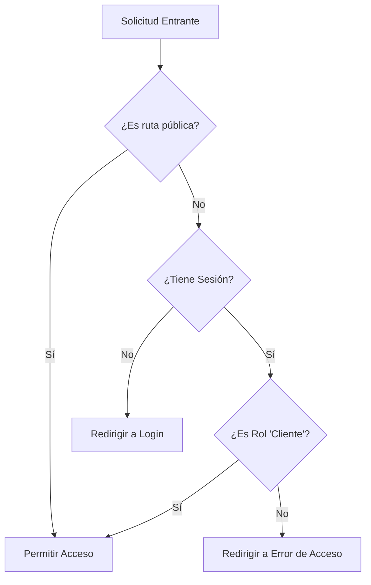

# Middleware de Seguridad

## Descripción General

El middleware de Next.js (`middleware.ts` y `lib/auth.config.ts`) actúa como la primera línea de defensa para las rutas del portal. Intercepta todas las solicitudes y aplica reglas de autenticación y autorización antes de renderizar cualquier página.

## Rutas Protegidas

El middleware protege el patrón `/portal/*`.

- **Públicas**: `/portal/auth/*` (Login, Reset Password, Error)
- **Protegidas**: `/portal/dashboard`, `/portal/pagos`, `/portal/perfil`, etc.
- **Excluidas**: `/_next`, `/static`, `/api/auth` (Manejadas por NextAuth internamente o archivos estáticos).

## Lógica de Autorización

### Diagrama de Flujo de Decisiones



1.  **Verificación de Sesión**:
    - Se verifica si existe una sesión válida de NextAuth.
    - Si no hay sesión y la ruta es protegida → Redirige a `/portal/auth/login`.

2.  **Verificación de Rol**:
    - Se extrae el rol del usuario desde el JWT (`user.role`).
    - **Regla**: Solo usuarios con el rol `Cliente` pueden acceder a `/portal/*` (excepto auth).
    - Si el usuario está logueado pero NO es Cliente (ej. Admin intentando entrar al portal de clientes) → Redirige a `/portal/auth/error?error=AccessDenied`.

3.  **Prevención de Bucles**:
    - Si el usuario ya está logueado e intenta entrar a `/portal/auth/login` → Redirige al Dashboard (`/portal`).

## Configuración Técnica

El middleware se define en `middleware.ts` pero la lógica reside en `lib/auth.config.ts` para ser compatible con Edge Runtime.

```typescript
// lib/auth.config.ts (Extracto)
authorized({ auth, request: { nextUrl } }) {
  const isLoggedIn = !!auth?.user;
  const isOnPortal = nextUrl.pathname.startsWith('/portal');
  const isOnAuth = nextUrl.pathname.startsWith('/portal/auth');

  if (isOnPortal && !isOnAuth) {
    if (isLoggedIn) {
      // Validar Rol
      if (auth.user?.role !== 'Cliente') {
         return Response.redirect(new URL('/portal/auth/error?error=AccessDenied', nextUrl));
      }
      return true;
    }
    return false; // Redirect to Login
  }
  // ...
}
```

## Logging

El middleware registra eventos de seguridad críticos.

### Ejemplos de Logs

```text
# Intento de Login Exitoso
[2024-02-02T10:00:00Z] [192.168.1.50] [LOGIN_ATTEMPT] [-] [SUCCESS] User: cliente@quintas.com

# Login Fallido (Password Incorrecto)
[2024-02-02T10:05:00Z] [192.168.1.50] [LOGIN_ATTEMPT] [-] [FAILURE] Invalid credentials

# Acceso Denegado por Rol
[2024-02-02T10:10:00Z] [192.168.1.100] [ACCESS_PROTECTED] [/portal/dashboard] [DENIED] Invalid Role: Admin

# Acceso Permitido
[2024-02-02T10:15:00Z] [192.168.1.50] [ACCESS_PROTECTED] [/portal/dashboard] [SUCCESS]
```

- `ACCESS_PROTECTED`: Intentos de acceso a rutas protegidas (Exitoso/Denegado).
- Se incluye IP, Usuario (si existe), Ruta y Resultado.
