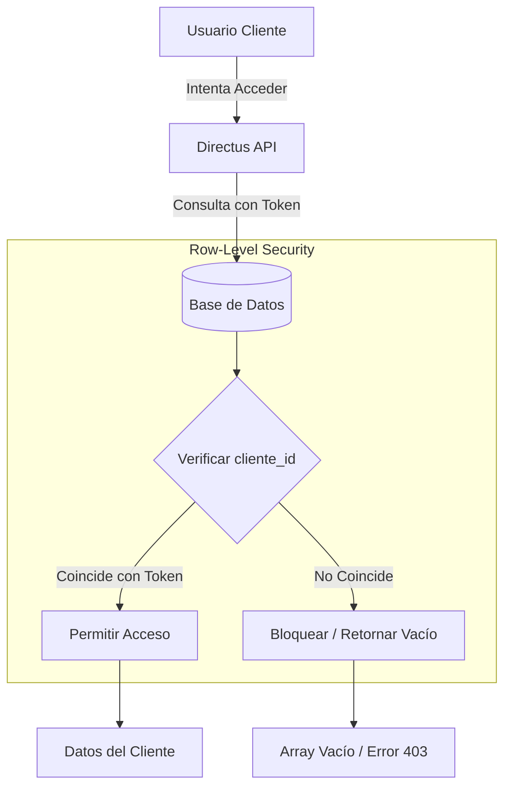

# Roles y Permisos

## Matriz de Roles

| Rol               | Descripción                       | Acceso al Portal | Acceso a Directus Admin |
| :---------------- | :-------------------------------- | :--------------: | :---------------------: |
| **Administrator** | Superusuario con acceso total     |        ✅        |           ✅            |
| **Cliente**       | Usuario final del CRM (Comprador) |        ✅        |           ❌            |
| **Vendedor**      | Agente de ventas                  |        ❌        |      ✅ (Limitado)      |

## Permisos del Rol "Cliente"

El rol **Cliente** está configurado en Directus con permisos estrictos de **Row-Level Security (RLS)**.

### Colecciones

| Colección  | Create | Read |    Update     | Delete | Filtro RLS                             |
| :--------- | :----: | :--: | :-----------: | :----: | :------------------------------------- |
| `clientes` |   ❌   |  ✅  | ✅ (Limitado) |   ❌   | `id = $CURRENT_USER.cliente_id`        |
| `ventas`   |   ❌   |  ✅  |      ❌       |   ❌   | `cliente_id = $CURRENT_USER.id`        |
| `pagos`    |   ❌   |  ✅  |      ❌       |   ❌   | `venta.cliente_id = $CURRENT_USER.id`  |
| `lotes`    |   ❌   |  ✅  |      ❌       |   ❌   | `ventas.cliente_id = $CURRENT_USER.id` |
| `archivos` |   ❌   |  ✅  |      ❌       |   ❌   | Relacionados a sus ventas/pagos        |

### Reglas de Seguridad

1.  **Lectura Propia**: Un cliente solo puede ver registros explícitamente vinculados a su ID.
2.  **Solo Lectura**: Los clientes no pueden crear ni eliminar registros clave (ventas, pagos, lotes).
3.  **Edición Limitada**: Solo pueden editar campos específicos de su perfil (ej. teléfono, email) si se habilita.
4.  **Aislamiento de Tenant**: El campo `cliente_id` es la llave maestra para el aislamiento de datos.

## Diagrama de Aislamiento (RLS)



## Gestión de Clientes

### Crear Nuevo Cliente

Para dar de alta un nuevo cliente con acceso al portal:

1.  **Directus Admin**:
    - Ir a módulo "Usuarios".
    - Crear usuario nuevo.
    - Asignar rol: `Cliente`.
    - Llenar datos básicos (Email, Password).
2.  **Vincular Datos CRM**:
    - Ir a colección `Clientes`.
    - Crear ficha del cliente.
    - Asignar el `user_id` del usuario creado anteriormente al campo `user` de la ficha.
    - Esto vincula la autenticación con los datos del negocio.

### Comandos SQL de Verificación

Utilice estos comandos en la base de datos para auditar permisos manualmente:

```sql
-- Verificar usuarios con rol Cliente
SELECT u.email, r.name as role
FROM directus_users u
JOIN directus_roles r ON u.role = r.id
WHERE r.name = 'Cliente';

-- Verificar vinculación Usuario-Cliente
SELECT c.id, c.nombre, c.apellido, u.email
FROM clientes c
JOIN directus_users u ON c.user_id = u.id;

-- Simular query de RLS (ejemplo conceptual)
-- Reemplazar 'CLIENTE_UUID' con un ID real
SELECT * FROM ventas
WHERE cliente_id = 'CLIENTE_UUID';
```

## Implementación en Frontend

El frontend utiliza el SDK de Directus y NextAuth para respetar estos permisos:

- **Sesión**: El token JWT de Directus se almacena en la sesión de NextAuth.
- **Consultas**: Todas las consultas a la API de Directus se hacen usando este token (`user.accessToken`).
- **Validación**: Si un usuario intenta manipular un ID en la URL, Directus rechazará la consulta (403 Forbidden) o devolverá vacío porque el token no tiene permiso sobre ese registro.
