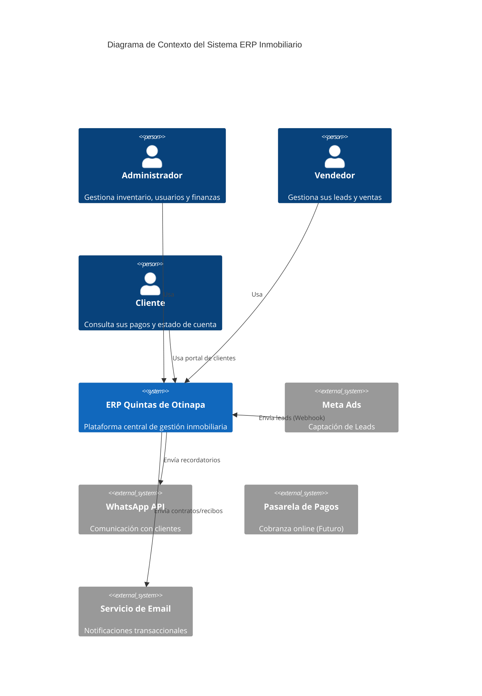
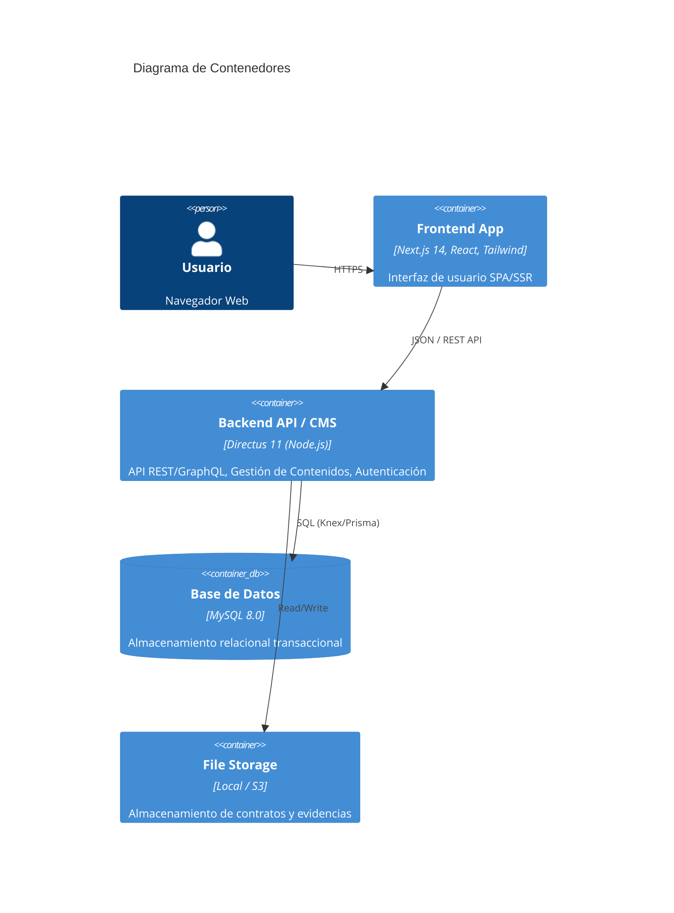
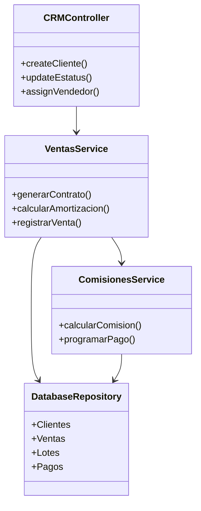

# Arquitectura Técnica - ERP Inmobiliario Quintas de Otinapa

**Versión:** 1.0.0
**Fecha:** 30 Enero 2026
**Autor:** Architecture Agent (implementado por Database Agent Warrior)
**Estado:** Fase 2 - Implementación CRM

## 1. Visión General

El sistema es un ERP Inmobiliario modular diseñado para gestionar el ciclo de vida completo de ventas de terrenos campestres, desde la captación de leads hasta la post-venta y gestión de cobranza.

La arquitectura sigue un patrón **Headless CMS + Modern Frontend**, utilizando Directus como núcleo de backend para acelerar el desarrollo de APIs y gestión de datos, y Next.js para una experiencia de usuario optimizada.

## 2. Arquitectura C4

### 2.1. Diagrama de Contexto (Nivel 1)

### 2.2. Diagrama de Contenedores (Nivel 2)

### 2.3. Diagrama de Componentes - Módulo CRM (Nivel 3)

## 3. Catálogo de Módulos (Backend)

El backend se extiende mediante **18 Extensiones de Directus** ubicadas en `/extensions`.

### 3.1 Módulos de Negocio Core

| Módulo | Tipo | Descripción y Responsabilidad |
|--------|------|-------------------------------|
| `directus-extension-hook-crm-logic` | **Hook** | **CRÍTICO.** Valida reglas invariantes (Anti-doble venta). Bloquea transacciones que violen la integridad del inventario. |
| `directus-endpoint-lotes` | **Endpoint** | Gestión especializada de lotes (inventario). |
| `ventas-api` | **Endpoint** | API transaccional para creación y gestión de contratos de venta. |
| `clientes` | **Endpoint** | Gestión de perfiles de clientes y sus relaciones. |
| `vendedores` | **Endpoint** | Gestión de fuerza de ventas y asignaciones. |
| `perfil` | **Endpoint** | Endpoint "Me" enriquecido para usuarios del portal. |

### 3.2 Módulos Financieros

| Módulo | Tipo | Descripción y Responsabilidad |
|--------|------|-------------------------------|
| `endpoint-pagos` | **Endpoint** | **Pasarela de Pagos.** Integra Stripe, valida montos, y aplica Rate Limiting (100 req/min). |
| `comisiones` | **Endpoint** | Cálculo de comisiones para vendedores (reglas fijas/variables). |
| `amortizacion` | **Endpoint** | Generador de tablas de amortización (proyección de pagos). |

## 4. Diseño de Base de Datos (Schema)

El esquema de base de datos ha sido normalizado (3NF) y adaptado para coexistir con tablas legacy (`lotes`) y nuevas tablas gestionadas por Directus (UUIDs).

### 3.1. Tablas Principales (CRM & Ventas)

| Tabla        | Tipo ID | Descripción                             | Relaciones Clave                                   |
| ------------ | ------- | --------------------------------------- | -------------------------------------------------- |
| `lotes`      | INT     | Inventario de terrenos (Legacy)         | FK -> `clientes`, `vendedores`                     |
| `clientes`   | UUID    | Base de datos de compradores/prospectos | 1:N con `ventas`                                   |
| `vendedores` | UUID    | Fuerza de ventas y comisionistas        | 1:N con `ventas`, `comisiones`                     |
| `ventas`     | UUID    | Tabla transaccional central             | FK -> `lote_id` (INT), `cliente_id`, `vendedor_id` |
| `pagos`      | UUID    | Tabla de amortización                   | FK -> `venta_id`                                   |
| `comisiones` | UUID    | Registro de pagos a vendedores          | FK -> `venta_id`, `vendedor_id`                    |

### 3.2. Estrategia de Migración Legacy

Para mantener la integridad con el sistema de mapas SVG existente (que usa IDs numéricos para los lotes):

1.  **Lotes**: Se mantiene `id` como `INT`.
2.  **Relaciones**: Se actualizaron las columnas `cliente_id` y `vendedor_id` en la tabla `lotes` para aceptar `CHAR(36)` (UUID) y apuntar a las nuevas tablas.
3.  **Ventas**: La tabla `ventas` utiliza `lote_id` (INT) para enlazar con el inventario, pero usa UUIDs para todo lo demás.

_Ver diagrama detallado en: `documentacion/ninja/ERD_CRM.md`_

## 4. Arquitectura de APIs

### 4.1. Endpoints Principales (Directus Auto-generated)

Directus expone automáticamente endpoints RESTful para cada colección creada.

- **Clientes**: `GET /items/clientes`, `POST /items/clientes`
- **Ventas**: `GET /items/ventas` (Con hooks para validación de negocio)
- **Pagos**: `GET /items/pagos` (Con lógica de cálculo de mora)

### 4.2. Custom Endpoints (Extensiones)

Se desarrollarán extensiones de Directus para lógica compleja que no cabe en un simple CRUD:

- `/custom/amortizacion/generar`: Genera tabla de pagos basada en monto, plazo y tasa.
- `/custom/reportes/ventas-mensuales`: Aggregations complejas para dashboards.

## 5. Patrones de Diseño & Mejores Prácticas

1.  **Repository Pattern (Implícito):** Directus actúa como un repositorio genérico. Para lógica compleja, se encapsulará el acceso a datos en Servicios dentro de extensiones.
2.  **Event-Driven (Webhooks/Flows):**
    - Al crear una venta -> Disparar Flow "Generar Tabla de Pagos".
    - Al recibir un pago -> Disparar Flow "Calcular Comisiones".
3.  **UUID First:** Todas las nuevas entidades usan UUID v4 para facilitar replicación y evitar enumeración.
4.  **Soft Deletes:** Directus maneja "archive" (status=archived) en lugar de borrado físico para trazabilidad.

## 6. Integraciones y Escalabilidad

- **Colas de Tareas:** Para envío de correos masivos o generación de PDFs, se usará un sistema de colas (BullMQ o Directus Flows async).
- **Cache:** Redis para cachear respuestas de API públicas (catálogo de lotes disponibles).
- **Webhooks:** Recepción de Leads desde Meta Ads directamente a endpoint `/webhooks/meta-leads`.

## 7. Checklist de Validación

- [x] Esquema de base de datos implementado y migrado.
- [x] Integridad referencial (FKs) validada entre tablas nuevas y legacy.
- [ ] Directus Introspection ejecutado (Admin Panel).
- [ ] Permisos (Roles) configurados para Vendedores vs Admins.
- [ ] Endpoints probados con Postman.
