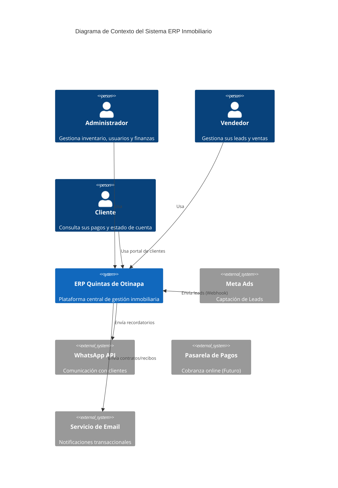
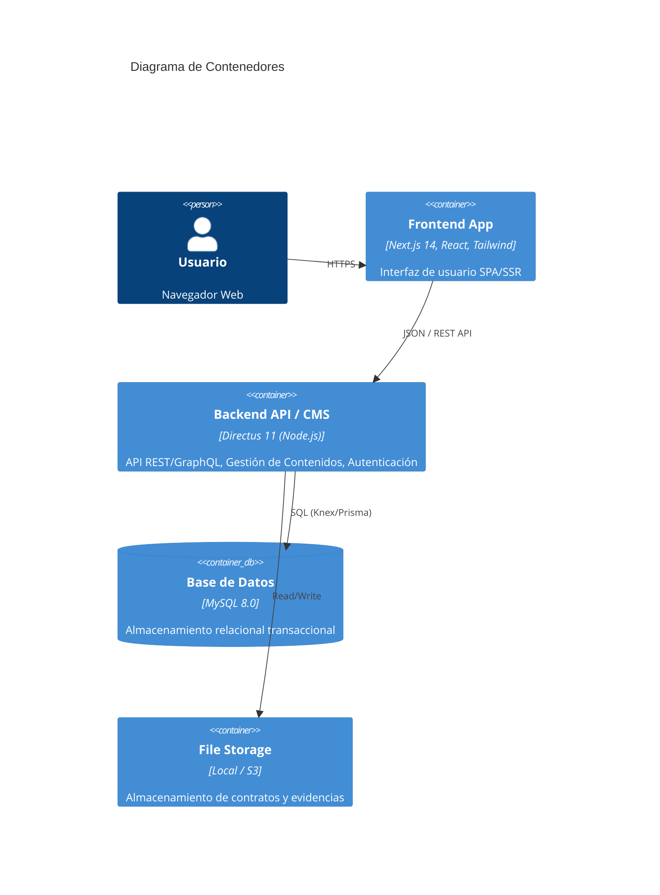
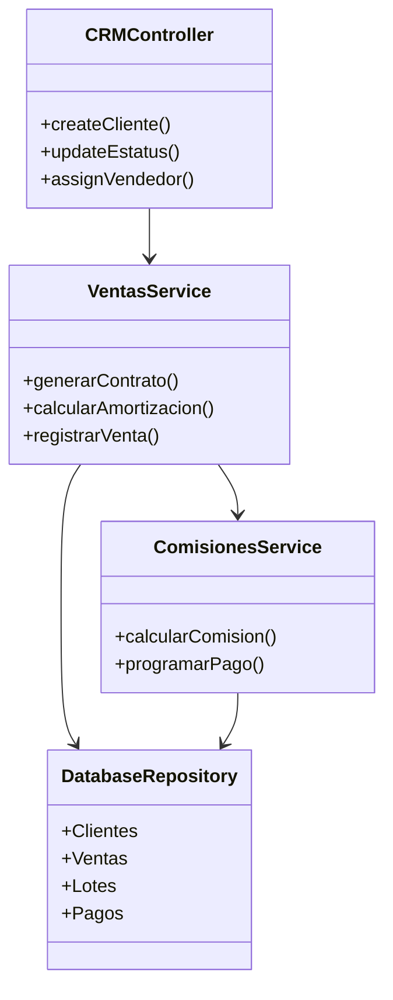

# Arquitectura Técnica - ERP Inmobiliario Quintas de Otinapa

**Versión:** 1.0.0
**Fecha:** 30 Enero 2026
**Autor:** Architecture Agent (implementado por Database Agent Warrior)
**Estado:** Fase 2 - Implementación CRM

## 1. Visión General

El sistema es un ERP Inmobiliario modular diseñado para gestionar el ciclo de vida completo de ventas de terrenos campestres, desde la captación de leads hasta la post-venta y gestión de cobranza.

La arquitectura sigue un patrón **Headless CMS + Modern Frontend**, utilizando Directus como núcleo de backend para acelerar el desarrollo de APIs y gestión de datos, y Next.js para una experiencia de usuario optimizada.

## 2. Arquitectura C4

### 2.1. Diagrama de Contexto (Nivel 1)

### 2.2. Diagrama de Contenedores (Nivel 2)

### 2.3. Diagrama de Componentes - Módulo CRM (Nivel 3)

## 3. Catálogo de Módulos (Backend)

El backend se extiende mediante **18 Extensiones de Directus** ubicadas en `/extensions`.

### 3.1 Módulos de Negocio Core

| Módulo | Tipo | Descripción y Responsabilidad |
|--------|------|-------------------------------|
| `directus-extension-hook-crm-logic` | **Hook** | **CRÍTICO.** Valida reglas invariantes (Anti-doble venta). Bloquea transacciones que violen la integridad del inventario. |
| `directus-endpoint-lotes` | **Endpoint** | Gestión especializada de lotes (inventario). |
| `ventas-api` | **Endpoint** | API transaccional para creación y gestión de contratos de venta. |
| `clientes` | **Endpoint** | Gestión de perfiles de clientes y sus relaciones. |
| `vendedores` | **Endpoint** | Gestión de fuerza de ventas y asignaciones. |
| `perfil` | **Endpoint** | Endpoint "Me" enriquecido para usuarios del portal. |

### 3.2 Módulos Financieros

| Módulo | Tipo | Descripción y Responsabilidad |
|--------|------|-------------------------------|
| `endpoint-pagos` | **Endpoint** | **Pasarela de Pagos.** Integra Stripe, valida montos, y aplica Rate Limiting (100 req/min). |
| `comisiones` | **Endpoint** | Cálculo de comisiones para vendedores (reglas fijas/variables). |
| `amortizacion` | **Endpoint** | Generador de tablas de amortización (proyección de pagos). |

## 4. Diseño de Base de Datos (Schema)

El esquema de base de datos ha sido normalizado (3NF) y adaptado para coexistir con tablas legacy (`lotes`) y nuevas tablas gestionadas por Directus (UUIDs).

### 3.1. Tablas Principales (CRM & Ventas)

| Tabla             | Tipo ID | Descripción                                   | Relaciones Clave                                   |
| ----------------- | ------- | --------------------------------------------- | -------------------------------------------------- |
| `lotes`           | INT     | Inventario de terrenos (Legacy)               | FK -> `clientes`, `vendedores`                     |
| `clientes`        | UUID    | Base de datos de compradores/prospectos       | 1:N con `ventas`                                   |
| `vendedores`      | UUID    | Fuerza de ventas y comisionistas              | 1:N con `ventas`, `comisiones`                     |
| `ventas`          | UUID    | Tabla transaccional central                   | FK -> `lote_id` (INT), `cliente_id`, `vendedor_id` |
| `pagos`           | UUID    | Cabecera/resumen de pagos por venta/cuota     | FK -> `venta_id`                                   |
| `pagos_movimientos` | UUID  | Ledger de movimientos parciales por cuota     | FK -> `venta_id`, `pago_id`                        |
| `comisiones`      | UUID    | Registro de pagos a vendedores                | FK -> `venta_id`, `vendedor_id`                    |

### 3.2. Estrategia de Migración Legacy

Para mantener la integridad con el sistema de mapas SVG existente (que usa IDs numéricos para los lotes):

1.  **Lotes**: Se mantiene `id` como `INT`.
2.  **Relaciones**: Se actualizaron las columnas `cliente_id` y `vendedor_id` en la tabla `lotes` para aceptar `CHAR(36)` (UUID) y apuntar a las nuevas tablas.
3.  **Ventas**: La tabla `ventas` utiliza `lote_id` (INT) para enlazar con el inventario, pero usa UUIDs para todo lo demás.

_Ver diagrama detallado en: `documentacion/ninja/ERD_CRM.md`_

### 3.3. Sincronizacion automatica Pagos ↔ Amortizacion mediante Ledger

Para garantizar consistencia entre los pagos registrados y el plan de amortizacion se adopto un modelo basado en **ledger de movimientos**:

- **Ledger `pagos_movimientos`:**
  - Registra cada movimiento financiero asociado a una cuota (`venta_id`, `numero_pago`): abonos, reembolsos, cancelaciones.
  - La tabla `pagos` actua como cabecera/resumen, mientras que `pagos_movimientos` es la fuente de verdad para el historial de pagos.

- **Dominio de estatus unificado:**
  - `amortizacion.estatus` mantiene el dominio restringido:
    - `['pendiente', 'pagado', 'parcial', 'vencido', 'cancelado']`.
  - El estado de la cuota se deriva de la suma de movimientos efectivos en `pagos_movimientos`.

- **Triggers de propagacion en `pagos_movimientos`:**
  - Definidos en la migracion `022_support_partial_payments.sql`.
  - `trg_pagos_mov_after_insert` (`AFTER INSERT ON pagos_movimientos`):
    - Recalcula `amortizacion.monto_pagado` como suma de todos los movimientos no cancelados de la cuota, considerando reembolsos (`tipo = 'reembolso'`) como montos negativos.
    - Actualiza `amortizacion.estatus` segun la comparacion `total_pagado` vs `monto_cuota`:
      - `total_pagado <= 0` → `pendiente`.
      - `0 < total_pagado < monto_cuota` → `parcial`.
      - `total_pagado >= monto_cuota` → `pagado`.
    - Ajusta `fecha_pago` cuando la cuota queda completamente pagada.
  - `trg_pagos_mov_after_update` (`AFTER UPDATE ON pagos_movimientos`):
    - Se ejecuta solo cuando cambian `monto`, `tipo` o `estatus` del movimiento.
    - Vuelve a calcular la suma agregada y actualiza `amortizacion` con la misma logica que el trigger de INSERT.
  - `trg_pagos_mov_after_delete` (`AFTER DELETE ON pagos_movimientos`):
    - Recalcula la cuota cuando se elimina un movimiento del ledger, garantizando consistencia tambien en operaciones de limpieza/correccion.

- **Migracion inicial de datos:**
  - La migracion `022_support_partial_payments.sql` crea un movimiento inicial en `pagos_movimientos` por cada fila existente en `pagos`, preservando la relacion (`venta_id`, `numero_pago`).
  - A partir de ese punto, la suma de movimientos por cuota es la fuente unificada para `amortizacion.monto_pagado` y `amortizacion.estatus`.

- **Integridad referencial y ausencia de movimientos huerfanos:**
  - `amortizacion` define un indice `UNIQUE (venta_id, numero_pago)` que garantiza una sola fila por cuota logica.
  - `pagos_movimientos` declara una FK compuesta (`venta_id`, `numero_pago`) → `amortizacion (venta_id, numero_pago)`.
  - Como consecuencia, es imposible insertar un movimiento si no existe previamente la cuota correspondiente en `amortizacion`.
  - Cualquier intento de crear un movimiento "huerfano" falla a nivel de base de datos por restriccion de clave foranea.

- **Implicaciones para dashboards y reportes:**
  - `amortizacion` se puede usar como **vista de estado actual** por cuota (pendiente/parcial/pagado) sin recorrer el ledger completo.
  - `pagos_movimientos` provee el **historial detallado** de pagos, reembolsos y cancelaciones para analitica, conciliacion y auditoria.

### 3.3.1. Convencion de montos y tipos en `pagos_movimientos`

- `monto`:
  - Siempre se almacena como valor **positivo**.
  - Esta restringido por un `CHECK (monto > 0)` a nivel de base de datos.
- `tipo` determina el signo logico del movimiento al calcular la suma por cuota:
  - `tipo = 'abono'` → el monto **suma** al total pagado.
  - `tipo = 'reembolso'` → el monto **resta** del total pagado.
- `estatus` controla si el movimiento participa en el calculo:
  - `estatus = 'aplicado'` → el movimiento se incluye.
  - `estatus = 'cancelado'` → el movimiento se excluye de la sumatoria (aporta 0).

El total pagado por cuota se calcula como:

- `total_pagado = SUM(monto_effectivo)` donde `monto_effectivo` es:
  - `+monto` para abonos aplicados.
  - `-monto` para reembolsos aplicados.
  - `0` para movimientos cancelados.

### 3.3.2. Derivacion de `fecha_pago`

- `fecha_pago` en `amortizacion` es un campo **derivado** del ledger:
  - Cuando `total_pagado >= monto_cuota` (cuota completamente pagada):
    - `fecha_pago` se establece como el `MAX(fecha_movimiento)` de los
      movimientos tipo `abono` con `estatus <> 'cancelado'` de esa cuota.
  - Cuando `total_pagado < monto_cuota` (pendiente o parcial):
    - `fecha_pago` se establece en `NULL` para evitar que quede "pegada" tras
      reembolsos o eliminaciones de movimientos.

Esto garantiza que:

- Al agregar nuevos abonos que completan la cuota, `fecha_pago` refleja la fecha
  del ultimo abono efectivo.
- Si posteriormente hay reembolsos o deletes que reduzcan el total por debajo
  de `monto_cuota`, la cuota vuelve a `parcial` o `pendiente` y `fecha_pago`
  se limpia automaticamente.

### 3.4. Riesgos y Consideraciones del Trigger Financiero

- **Tipo de trigger (`AFTER INSERT` / `AFTER UPDATE` en ledger):**
  - La logica financiera depende del estado final del movimiento tras aplicar todas las validaciones de integridad.
  - Al operar sobre `pagos_movimientos` (y no sobre `pagos` directamente) se evitan ambiguedades entre cabeceras y transacciones.

- **Condiciones de ejecucion (hardening):**
  - En `AFTER UPDATE` solo se recalcula cuando cambia `monto`, `tipo` o `estatus` del movimiento.
  - Esto evita recalculos innecesarios ante cambios puramente descriptivos (notas, timestamps).

- **Modelo de escritura recomendado:**
  - Los cambios financieros (nuevos pagos, reembolsos, cancelaciones) deben expresarse como nuevos registros o actualizaciones en `pagos_movimientos`.
  - `amortizacion` se trata como tabla derivada para los campos `monto_pagado`, `estatus` y `fecha_pago`; no deberia ser escrita directamente por la aplicacion salvo scripts de correccion controlados.

- **Race conditions:**
  - Si procesos externos modificaran directamente `amortizacion` mientras otros insertan/actualizan `pagos_movimientos`, el ultimo escritor prevaleceria.
  - La mitigacion pasa por centralizar las operaciones financieras en el ledger y restringir ediciones directas en `amortizacion`.

- **Cobertura de pruebas:**
  - `tests/test_pagos_movimientos_trigger.sql` valida:
    - Tres movimientos parciales que acumulan el total de la cuota y marcan la amortizacion como `pagado`.
    - Un movimiento de tipo `reembolso` que reduce el monto pagado y regresa el estado de la cuota a `parcial`.
  - `tests/test_pago_trigger.sql` se mantiene como apoyo para escenarios legacy, pero el flujo recomendado es trabajar sobre el ledger de `pagos_movimientos`.

## 4. Arquitectura de APIs

### 4.1. Endpoints Principales (Directus Auto-generated)

Directus expone automáticamente endpoints RESTful para cada colección creada.

- **Clientes**: `GET /items/clientes`, `POST /items/clientes`
- **Ventas**: `GET /items/ventas` (Con hooks para validación de negocio)
- **Pagos**: `GET /items/pagos` (Con lógica de cálculo de mora)

### 4.2. Custom Endpoints (Extensiones)

Se desarrollarán extensiones de Directus para lógica compleja que no cabe en un simple CRUD:

- `/custom/amortizacion/generar`: Genera tabla de pagos basada en monto, plazo y tasa.
- `/custom/reportes/ventas-mensuales`: Aggregations complejas para dashboards.

## 5. Patrones de Diseño & Mejores Prácticas

1.  **Repository Pattern (Implícito):** Directus actúa como un repositorio genérico. Para lógica compleja, se encapsulará el acceso a datos en Servicios dentro de extensiones.
2.  **Event-Driven (Webhooks/Flows):**
    - Al crear una venta -> Disparar Flow "Generar Tabla de Pagos".
    - Al recibir un pago -> Disparar Flow "Calcular Comisiones".
3.  **UUID First:** Todas las nuevas entidades usan UUID v4 para facilitar replicación y evitar enumeración.
4.  **Soft Deletes:** Directus maneja "archive" (status=archived) en lugar de borrado físico para trazabilidad.

## 6. Integraciones y Escalabilidad

- **Colas de Tareas:** Para envío de correos masivos o generación de PDFs, se usará un sistema de colas (BullMQ o Directus Flows async).
- **Cache:** Redis para cachear respuestas de API públicas (catálogo de lotes disponibles).
- **Webhooks:** Recepción de Leads desde Meta Ads directamente a endpoint `/webhooks/meta-leads`.

## 7. Checklist de Validación

- [x] Esquema de base de datos implementado y migrado.
- [x] Integridad referencial (FKs) validada entre tablas nuevas y legacy.
- [ ] Directus Introspection ejecutado (Admin Panel).
- [ ] Permisos (Roles) configurados para Vendedores vs Admins.
- [ ] Endpoints probados con Postman.
