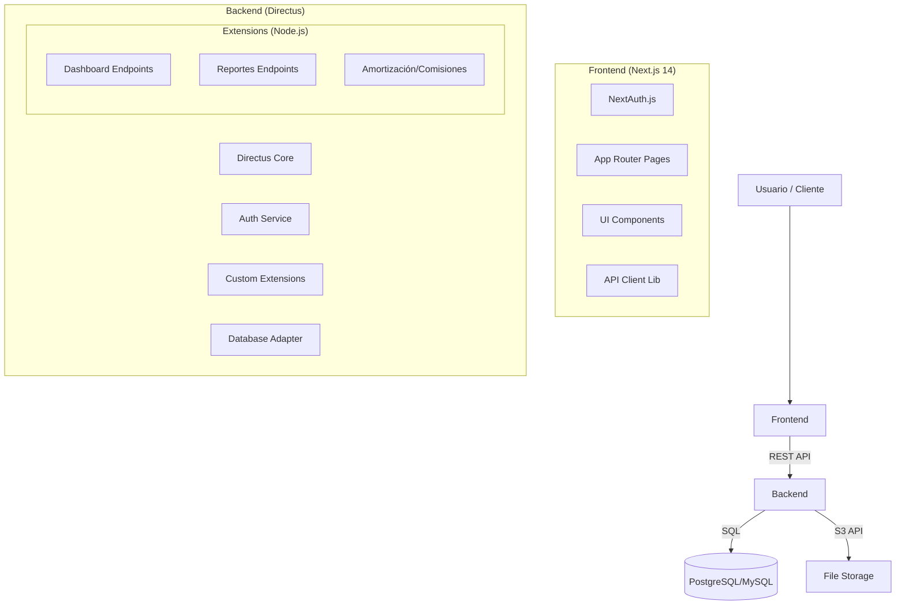

# Arquitectura y Diseño - Quintas-CRM

## 1. Visión General

Quintas-CRM sigue una arquitectura **Headless CMS** desacoplada, utilizando **Directus** como backend (BaaS) y **Next.js** como frontend. Esta arquitectura permite flexibilidad, escalabilidad y rapidez de desarrollo.

## 2. Diagrama de Componentes

## 3. Decisiones Técnicas Clave

### 3.1 Backend: Directus Extensions

En lugar de usar un servidor Express separado, utilizamos **Directus Extensions** para la lógica de negocio personalizada.

- **Beneficio:** Aprovechamos la autenticación, conexión a BD y gestión de permisos de Directus.
- **Implementación:** Endpoints custom en `extensions/endpoints/*`.
- **Librerías:** `pdfkit` (PDFs), `exceljs` (Excel), `dayjs` (Fechas).

### 3.2 Frontend: Next.js App Router

- **Rendering:** Server Components para dashboard (mayor performance, SEO no relevante aquí pero sí la carga inicial).
- **UI Kit:** Tailwind CSS + Shadcn/UI (Radix Primitives) para accesibilidad y diseño consistente.
- **Gráficos:** Recharts para visualizaciones ligeras y responsivas.

### 3.3 Base de Datos

- **Modelo Relacional:**
  - `lotes` (1:N) `ventas`
  - `clientes` (1:N) `ventas`
  - `ventas` (1:N) `pagos`
  - `vendedores` (1:N) `comisiones`
- **Seguridad:** Row Level Security simulado mediante permisos de roles en Directus.

## 4. Flujos de Datos Críticos

### 4.1 Generación de Estado de Cuenta

1.  Frontend solicita `/reportes/estado-cuenta-cliente?id=123`.
2.  Backend valida token JWT.
3.  Extension `reportes`:
    - Consulta `ventas` del cliente.
    - Consulta `pagos` asociados.
    - Calcula saldo pendiente y moras.
4.  Backend genera JSON o PDF (stream).
5.  Frontend recibe y muestra/descarga.

### 4.2 Registro de Venta

1.  Frontend envía POST a colección `ventas`.
2.  Directus Hook `ventas.items.create`:
    - Valida disponibilidad del lote.
    - Cambia estatus de lote a "Vendido".
    - Genera tabla de amortización inicial (llamada interna a servicio).
3.  Respuesta 200 OK.
