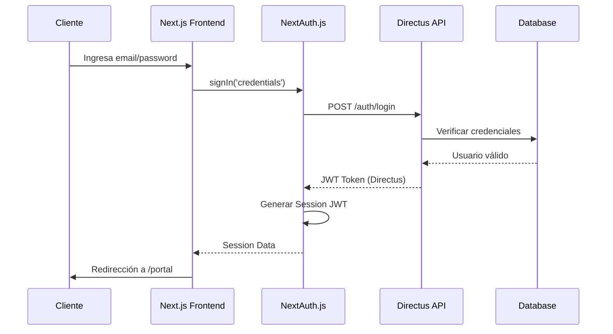
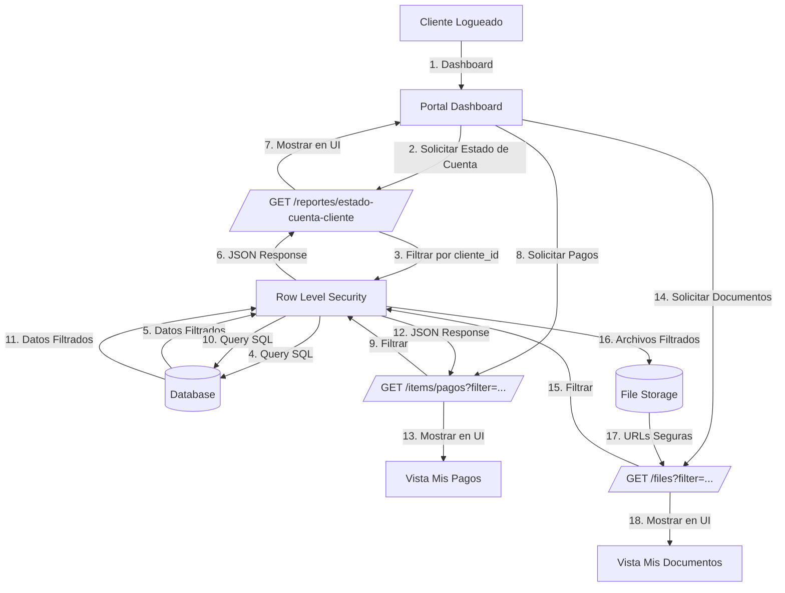

# PROMPTS MAESTROS OPTIMIZADOS - FASE 5: PORTAL DE CLIENTES

## Basados en el Estado Actual del Proyecto (Post-Fase 4)

**Fecha de Creación:** 31 de Enero de 2026 **Estado Base:** Fase 4 Completada y Validada **Arquitectura:** Directus 11.14.0 + Next.js 14 + MySQL

---

## INTRODUCCIÓN

Este documento contiene los **PROMPTS MAESTROS OPTIMIZADOS** para la Fase 5 (Portal de Clientes), diseñados específicamente basándose en:

- El estado real del proyecto post-Fase 4
- Los patrones de código establecidos en fases anteriores
- La arquitectura Directus + Next.js validada
- Las lecciones aprendidas de auditorías anteriores

**Objetivo:** Implementar un Portal de Clientes seguro, funcional y escalable manteniendo la calidad y consistencia del código existente.

---

## ESTRATEGIA DE FASE 5

### Desglose por Sprints (2 semanas)

**Sprint 5.1: Seguridad y Acceso (Semana 1)**

- T5.1: Configuración de NextAuth.js con Directus
- T5.2: Implementación de Rol "Cliente" y permisos RLS
- T5.3: Páginas de autenticación (Login, Recuperar Contraseña)
- T5.4: Middleware de protección de rutas

**Sprint 5.2: Funcionalidad del Portal (Semana 2)**

- T5.5: Endpoint `/perfil` (Mis Datos)
- T5.6: Dashboard del cliente (Estado de Cuenta)
- T5.7: Vista de Mis Pagos
- T5.8: Gestión de Documentos (Contratos, Recibos)

---

## AGENTES DESENVOLVIENDO LA FASE 5

### 1\. Agente de Seguridad y Autenticación (NEW - Especializado)

**Responsable:** Sprint 5.1 (Tareas T5.1, T5.2, T5.3, T5.4) **Competencias:** NextAuth.js, OAuth 2.0, JWT, Row-Level Security, Directus Permissions

### 2\. Agente de Backend Development

**Responsable:** Sprint 5.2 - Backend (Tareas T5.5) **Competencias:** Directus Extensions, API Design, SQL, Node.js

### 3\. Agente de Frontend Development

**Responsable:** Sprint 5.2 - Frontend (Tareas T5.6, T5.7, T5.8) **Competencias:** Next.js 14, React, TypeScript, UI/UX

### 4\. Agente QA & Testing

**Responsable:** Validación de toda la fase y pruebas de seguridad **Competencias:** Security Testing, Integration Testing, Code Review

---

# PROMPT MAESTRO #5.1 - SPRINT 5.1: SEGURIDAD Y ACCESO

## 1\. AGENTE RESPONSABLE

**Nombre:** Agente de Seguridad y Autenticación

**Rol:** Especialista en implementación de sistemas de autenticación seguros, gestión de identidades y control de acceso basado en roles.

**Competencias Específicas:**

- NextAuth.js v5 (Auth.js) - Configuración avanzada
- OAuth 2.0 y OpenID Connect (OIDC)
- JWT (JSON Web Tokens) - Generación y validación
- Row-Level Security (RLS) en Directus
- Gestión de sesiones y tokens de refresco
- Seguridad de contraseñas y recuperación de credenciales
- Middleware de rutas en Next.js App Router
- Protección CSRF y XSS

---

## 2\. CONTEXTO EXHAUSTIVO

### 2.1 Estado Actual del Proyecto

**Fases 1-4 Completadas:**

- ✅ Backend Directus 11.14.0 configurado y operativo
- ✅ Frontend Next.js 14 con App Router establecido
- ✅ Base de datos MySQL con tablas CRM (`clientes`, `ventas`, `pagos`, `comisiones`, `vendedores`, `lotes`)
- ✅ Extensiones personalizadas implementadas (Dashboard, Reportes, Finanzas)
- ✅ Arquitectura Headless CMS validada

**Sistema de Autenticación Actual:**

- Directus tiene autenticación nativa (username/password)
- Ya existen roles de usuario en Directus (Admin, Vendedor)
- NO hay autenticación configurada en Next.js
- NO existe un portal para clientes externos
- NO hay implementado NextAuth.js en el proyecto

### 2.2 Arquitectura a Implementar

**Diagrama de Flujo de Autenticación:**



**Stack Tecnológico:**

- **Auth Framework:** NextAuth.js v5 (Auth.js)
- **Auth Provider:** Credentials Provider (Directus backend)
- **Session Strategy:** JWT (Stateless)
- **Role Management:** Directus Roles + Custom Claims en JWT
- **Password Recovery:** Directus Password Reset Flow
- **Route Protection:** Next.js Middleware (`middleware.ts`)

### 2.3 Desafíos y Consideraciones

**Desafíos Técnicos:**

1.  **Integración NextAuth + Directus:** Debe usar Directus como proveedor de autenticación (Credentials Provider), no un OAuth externo
2.  **Tenant Isolation:** Clientes solo deben ver SUS propios datos (Row-Level Security)
3.  **Token Management:** Directus retorna JWT, pero NextAuth también genera su propio token. Deben coexistir.
4.  **Session Duration:** Equilibrar seguridad (sesiones cortas) con UX (no pedir login constantemente)
5.  **Password Recovery:** Implementar flujo completo usando Directus password reset endpoints
6.  **Route Protection:** Middleware debe proteger todas las rutas `/portal/*` pero permitir acceso público a login

**Consideraciones de Seguridad:**

- **Crítico:** Prevenir que un cliente acceda a datos de otro cliente
- **Crítico:** Implementar rate limiting en endpoint de login (prevenir brute force)
- **Alta:** HTTPS obligatorio en producción
- **Alta:** Tokens con expiración adecuada (access token: 1h, refresh: 7d)
- **Media:** Logging de intentos fallidos de login
- **Media:** Validación fuerte de contraseñas (mínimo 8 caracteres, 1 mayúscula, 1 número)

### 2.4 Dependencias de Fases Anteriores

**Fase 2 (Base de Datos CRM):**

- ✅ Tabla `clientes` existe con campos: email, password, nombre, apellido, telefono, status
- ✅ Relación `clientes.id` → `ventas.cliente_id` establecida
- ✅ Directus está configurado con sistema de usuarios y roles

**Fase 4 (Dashboards y Reportes):**

- ✅ Backend tiene endpoint `/reportes/estado-cuenta-cliente?id={cliente_id}` que se reutilizará
- ✅ Frontend tiene librería `directus-api.ts` que debe extenderse para auth

### 2.5 Requisitos No Funcionales

**Performance:**

- Login debe completarse en < 2s (promedio)
- Validación de sesión en middleware debe ser < 100ms
- Tiempo de generación de token de reset de password: < 500ms

**Security:**

- Rate limiting: Máximo 5 intentos de login fallidos por IP en 15 minutos
- Bloqueo temporal después de 5 intentos fallidos: 15 minutos
- Tokens JWT con firmas RS256 (no HS256)
- Cookies HTTPOnly, Secure, SameSite=Strict

**UX:**

- Mensajes de error claros pero no revelan información sensible (no decir "usuario no existe", solo "credenciales inválidas")
- Feedback visual inmediato en todos los pasos del flujo de autenticación
- Opción "Recordarme" (extender sesión a 30 días)
- Validación en tiempo real de formato de email

---

## 3\. TAREAS A REALIZAR

### T5.1: Configuración de NextAuth.js con Directus

**Descripción:** Implementar NextAuth.js v5 (Auth.js) configurado para usar Directus como proveedor de credenciales. Incluye instalación de dependencias, configuración inicial, setup de session strategy JWT, y prueba de integración con Directus Auth API.

**Dependencias:** Ninguna (tarea base del sprint)

**Sub-tareas:**

1.  **T5.1.1 - Instalación de Dependencias**
    - Instalar `next-auth@beta` (v5) usando npm/yarn
    - Instalar `@auth/directus-adapter` si existe, o implementar adaptador custom
    - Verificar compatibilidad con Next.js 14 App Router
2.  **T5.1.2 - Configuración de Variables de Entorno**
    - Definir variables en `.env.local`:

      ```
      NEXTAUTH_URL=http://localhost:3000
      NEXTAUTH_SECRET=<generated-secret>
      DIRECTUS_URL=http://localhost:8055
      DIRECTUS_ADMIN_EMAIL=admin@example.com
      DIRECTUS_ADMIN_PASSWORD=<admin-password>
      ```

    - Documentar en `README.md` o `docs/env-variables.md`
3.  **T5.1.3 - Configuración de NextAuth**
    - Crear archivo `lib/auth.config.ts` con configuración base:

      ```typescript
      import NextAuth from 'next-auth';
      import CredentialsProvider from 'next-auth/providers/credentials';

      export const { handlers, signIn, signOut, auth } = NextAuth({
        pages: {
          signIn: '/portal/login',
          signOut: '/portal/logout',
          error: '/portal/auth/error',
        },
        session: {
          strategy: 'jwt',
        },
        providers: [
          CredentialsProvider({
            name: 'Directus',
            credentials: {
              email: { label: 'Email', type: 'email' },
              password: { label: 'Password', type: 'password' },
            },
            async authorize(credentials) {
              // Implementación: Llamar a Directus Auth API
              // Retornar usuario con rol y claims
            },
          }),
        ],
      });
      ```

    - Crear archivo `lib/auth.ts` con helpers de sesión
4.  **T5.1.4 - Implementación de authorize() Function**
    - Implementar lógica de autenticación contra Directus:

      ```typescript
      async authorize(credentials) {
        // 1. Validar credentials no sean null/undefined
        // 2. Llamar a POST /auth/login de Directus
        // 3. Si éxito, obtener datos del usuario y rol
        // 4. Verificar que el usuario tenga rol "Cliente"
        // 5. Retornar objeto user con: id, email, name, role, directus_token
        // 6. Si error, retornar null
      }
      ```

    - Manejar errores específicos (credenciales inválidas, usuario no encontrado, cuenta inactiva)
5.  **T5.1.5 - JWT Callback Configuration**
    - Implementar `jwt()` callback para agregar claims personalizados:

      ```typescript
      async jwt({ token, user }) {
        if (user) {
          token.id = user.id
          token.role = user.role
          token.directusToken = user.directusToken
          token.clienteId = user.clienteId // ID en tabla clientes
        }
        return token
      }
      ```
6.  **T5.1.6 - Session Callback Configuration**
    - Implementar `session()` callback para exponer datos en useSession():

      ```typescript
      async session({ session, token }) {
        session.user.id = token.id
        session.user.role = token.role
        session.user.clienteId = token.clienteId
        return session
      }
      ```
7.  **T5.1.7 - Route Handlers Setup**
    - Crear `app/api/auth/[...nextauth]/route.ts`:

      ```typescript
      import { handlers } from '@/lib/auth.config';
      export const { GET, POST } = handlers;
      ```

**Deliverables:**

- ✅ Dependencias instaladas y verificadas en `package.json`
- ✅ Variables de entorno configuradas y documentadas
- ✅ Archivo `lib/auth.config.ts` con configuración completa
- ✅ Archivo `lib/auth.ts` con helpers
- ✅ Route handler `app/api/auth/[...nextauth]/route.ts`
- ✅ Función `authorize()` implementada y probada
- ✅ JWT y Session callbacks configurados

**Criterios de Éxito:**

- ✅ Login exitoso con credenciales válidas de cliente
- ✅ Login fallido con credenciales inválidas
- ✅ JWT token generado correctamente con claims personalizados
- ✅ Session accesible desde `useSession()` hook
- ✅ No errores en console del navegador durante auth flow

---

### T5.2: Implementación de Rol "Cliente" y Permisos RLS

**Descripción:** Crear el rol "Cliente" en Directus con permisos de lectura limitados usando Row-Level Security (RLS). Configurar permisos para que cada cliente solo pueda acceder a sus propios datos.

**Dependencias:** T5.1 (NextAuth configurado)

**Sub-tareas:**

1.  **T5.2.1 - Crear Rol "Cliente" en Directus**
    - Acceder a panel de administración de Directus
    - Navegar a Settings → Roles & Permissions
    - Crear nuevo rol: `Cliente`
    - Descripción: "Rol para clientes externos del portal"
2.  **T5.2.2 - Configurar Permisos de Colección `clientes`**
    - Asignar permisos al rol Cliente sobre colección `clientes`:
      - Read: ✅ (Solo registros donde `user_id` = usuario actual)
      - Create: ❌
      - Update: ❌ (Solo campos permitidos: telefono, email - si se habilita self-update)
      - Delete: ❌
    - Configurar filtro de acceso:

      ```
      user_id eq $CURRENT_USER
      ```

    - Ajustar field permissions: cliente puede ver sus propios datos
3.  **T5.2.3 - Configurar Permisos de Colección `ventas`**
    - Asignar permisos al rol Cliente sobre colección `ventas`:
      - Read: ✅ (Solo registros donde `cliente_id` = cliente actual)
      - Create: ❌
      - Update: ❌
      - Delete: ❌
    - Configurar filtro de acceso:

      ```
      cliente_id eq $CURRENT_CLIENTE_ID
      ```

    - Field permissions: Ver todos los campos excepto `comision_interna` y otros datos internos
4.  **T5.2.4 - Configurar Permisos de Colección `pagos`**
    - Asignar permisos al rol Cliente sobre colección `pagos`:
      - Read: ✅ (Solo registros de sus ventas)
      - Create: ❌
      - Update: ❌
      - Delete: ❌
    - Configurar filtro de acceso:

      ```
      venta/cliente_id eq $CURRENT_CLIENTE_ID
      ```

    - Field permissions: Ver todos los campos
5.  **T5.2.5 - Configurar Permisos de Colección `lotes`**
    - Asignar permisos al rol Cliente sobre colección `lotes`:
      - Read: ✅ (Solo el lote que compró)
      - Create: ❌
      - Update: ❌
      - Delete: ❌
    - Configurar filtro de acceso:

      ```
      id in (SELECT lote_id FROM ventas WHERE cliente_id eq $CURRENT_CLIENTE_ID)
      ```
6.  **T5.2.6 - Configurar Permisos de Archivos (Documentos)**
    - Asignar permisos al rol Cliente sobre la carpeta de documentos:
      - Read: ✅ (Solo archivos relacionados a sus contratos/recibos)
      - Create: ❌
      - Update: ❌
      - Delete: ❌
    - Configurar filtro:

      ```
      uploaded_by eq $CURRENT_USER OR metadata.cliente_id eq $CURRENT_CLIENTE_ID
      ```
7.  **T5.2.7 - Asociar Usuarios Directus con Clientes**
    - Verificar que tabla `clientes` tenga campo `user_id` (relación a `directus_users`)
    - Si no existe, agregar migration:

      ```sql
      ALTER TABLE clientes ADD COLUMN user_id INT REFERENCES directus_users(id);
      ```

    - Crear índice en `user_id`:

      ```sql
      CREATE INDEX idx_clientes_user_id ON clientes(user_id);
      ```
8.  **T5.2.8 - Crear Usuario de Prueba**
    - Crear usuario Directus con email: `cliente.prueba@quintas.com`
    - Asignar rol: `Cliente`
    - Crear registro en tabla `clientes` asociado a este usuario
    - Password: `Prueba123!` (debe cumplir políticas de contraseña)
9.  **T5.2.9 - Documentar Permisos**
    - Crear documento `docs/security/roles-permissions.md` con:
      - Matriz de permisos por colección
      - Diagrama de filtros RLS
      - Instrucciones para crear nuevos clientes

**Deliverables:**

- ✅ Rol "Cliente" creado en Directus
- ✅ Permisos configurados para colecciones: clientes, ventas, pagos, lotes, archivos
- ✅ Filtros RLS implementados y probados
- ✅ Campo `user_id` agregado a tabla `clientes` (si no existía)
- ✅ Índices en `user_id` creados
- ✅ Usuario de prueba creado
- ✅ Documentación de permisos creada

**Criterios de Éxito:**

- ✅ Cliente solo puede ver SUS datos en todas las colecciones
- ✅ Cliente NO puede ver datos de otros clientes (tentar con SQL injection o manipulación de IDs)
- ✅ Cliente NO puede crear/actualizar/eliminar registros
- ✅ Permisos se aplican tanto vía API REST como vía Directus SDK

---

### T5.3: Páginas de Autenticación (Login, Recuperar Contraseña)

**Descripción:** Crear páginas de autenticación para el portal de clientes: Login, Forgot Password, Reset Password. Implementar validación de formularios, manejo de errores y UX optimizada.

**Dependencias:** T5.1 (NextAuth configurado), T5.2 (Rol Cliente configurado)

**Sub-tareas:**

1.  **T5.3.1 - Crear Estructura de Directorios**

    ```
    app/
      portal/
        auth/
          login/
            page.tsx
          forgot-password/
            page.tsx
          reset-password/
            page.tsx
          error/
            page.tsx
        layout.tsx
    ```

2.  **T5.3.2 - Crear Layout del Portal**
    - Crear `app/portal/layout.tsx` con:
      - Navbar del portal (logo, menú usuario)
      - Footer minimalista
      - Container principal con márgenes consistentes
      - Sesión check (si no autenticado, redirigir a `/portal/auth/login`)
3.  **T5.3.3 - Implementar Página de Login**
    - Crear `app/portal/auth/login/page.tsx`:
      - Formulario con campos: email, password
      - Checkbox "Recordarme"
      - Botón "Iniciar Sesión"
      - Link "¿Olvidaste tu contraseña?" → `/portal/auth/forgot-password`
      - Manejo de estados: idle, loading, error, success
    - Usar componentes existentes (Button, Input, Card) del sistema
    - Implementar validación con React Hook Form o Zod:
      - Email: formato válido
      - Password: mínimo 8 caracteres
    - Integrar con NextAuth `signIn('credentials')`
    - Manejar errores: credenciales inválidas, cuenta inactiva, servidor no disponible
4.  **T5.3.4 - Implementar Página de Forgot Password**
    - Crear `app/portal/auth/forgot-password/page.tsx`:
      - Formulario con campo: email
      - Botón "Enviar enlace de recuperación"
      - Link "Volver al login" → `/portal/auth/login`
    - Validar formato de email
    - Implementar llamada a Directus password reset:

      ```typescript
      POST / auth / password / reset / request;
      {
        email: string;
      }
      ```

    - Manejar respuesta:
      - ✅ Success: "Si el email existe, recibirás un enlace de recuperación"
      - ❌ Error: "Error al solicitar recuperación. Inténtalo nuevamente."
    - NO revelar si email existe o no (security best practice)
5.  **T5.3.5 - Implementar Página de Reset Password**
    - Crear `app/portal/auth/reset-password/page.tsx`:
      - Recibir token de URL (`?token=xxx`)
      - Formulario con campos: password, confirm_password
      - Validación: contraseñas coinciden, cumple políticas
      - Botón "Restablecer contraseña"
    - Implementar llamada a Directus password reset:

      ```typescript
      POST /auth/password/reset
      { token: string, password: string }
      ```

    - Manejar respuestas:
      - ✅ Success: Redirigir a login con mensaje de éxito
      - ❌ Error: Token inválido o expirado
6.  **T5.3.6 - Implementar Página de Error**
    - Crear `app/portal/auth/error/page.tsx`:
      - Mostrar mensaje de error basado en `error` query param
      - Botón "Volver al login"
      - Diseño consistente con otras páginas de auth
7.  **T5.3.7 - Implementar UI Components Reutilizables**
    - Crear `components/portal/auth/AuthCard.tsx`: Wrapper para formularios de auth
    - Crear `components/portal/auth/PasswordField.tsx`: Input con toggle show/hide
    - Crear `components/portal/auth/SuccessMessage.tsx`: Mensaje de éxito con icono
8.  **T5.3.8 - Agregar Animaciones y Transiciones**
    - Usar Framer Motion o CSS transitions para:
      - Fade-in de formularios
      - Transición suave entre loading/success/error
      - Shake animation en error de credenciales
9.  **T5.3.9 - Implementar Responsividad**
    - Asegurar que formularios se vean bien en:
      - Desktop (> 1024px): Ancho fijo 400px, centrado
      - Tablet (768-1024px): Ancho fluido 90%
      - Mobile (< 768px): Full width, padding optimizado
10. **T5.3.10 - Testing Manual**
    - Probar flujo completo de login exitoso
    - Probar login con credenciales inválidas
    - Probar flujo de forgot password con email válido
    - Probar flujo de reset password con token válido
    - Probar reset con token expirado
    - Probar en desktop y mobile

**Deliverables:**

- ✅ Página Login implementada y funcional
- ✅ Página Forgot Password implementada y funcional
- ✅ Página Reset Password implementada y funcional
- ✅ Página Error implementada
- ✅ Layout del Portal creado
- ✅ Componentes reutilizables creados
- ✅ Validaciones de formularios implementadas
- ✅ Animaciones y transiciones agregadas
- ✅ Responsividad verificada

**Criterios de Éxito:**

- ✅ Usuario puede loguearse exitosamente con credenciales válidas
- ✅ Usuario ve mensajes de error apropiados en credenciales inválidas
- ✅ Usuario puede solicitar recuperación de contraseña
- ✅ Usuario puede restablecer contraseña con token válido
- ✅ Usuario ve mensaje de error en token expirado
- ✅ UI es consistente, responsive y accesible

---

### T5.4: Middleware de Protección de Rutas

**Descripción:** Implementar middleware de Next.js para proteger todas las rutas del portal (`/portal/*`). El middleware debe verificar que el usuario esté autenticado y tenga rol "Cliente" antes de permitir acceso.

**Dependencias:** T5.1 (NextAuth configurado), T5.2 (Rol Cliente configurado), T5.3 (Páginas de auth creadas)

**Sub-tareas:**

1.  **T5.4.1 - Crear Archivo Middleware**
    - Crear `middleware.ts` en raíz del proyecto:

      ```typescript
      import { auth } from '@/lib/auth.config';
      import { NextResponse } from 'next/server';
      import type { NextRequest } from 'next/server';
      ```
2.  **T5.4.2 - Definir Rutas Públicas y Protegidas**
    - Rutas públicas (no requieren auth):
      - `/portal/auth/login`
      - `/portal/auth/forgot-password`
      - `/portal/auth/reset-password`
      - `/portal/auth/error`
    - Rutas protegidas (requieren auth + rol Cliente):
      - `/portal/*` (todas las demás)
3.  **T5.4.3 - Implementar Lógica de Middleware**

    ```typescript
    export async function middleware(request: NextRequest) {
      const session = await auth();
      const { pathname } = request.nextUrl;

      // Rutas públicas: permitir acceso sin auth
      const publicPaths = [
        '/portal/auth/login',
        '/portal/auth/forgot-password',
        '/portal/auth/reset-password',
        '/portal/auth/error',
      ];
      const isPublicPath = publicPaths.some((path) => pathname.startsWith(path));

      if (isPublicPath) {
        // Si usuario ya autenticado, redirigir a home del portal
        if (session?.user) {
          return NextResponse.redirect(new URL('/portal', request.url));
        }
        return NextResponse.next();
      }

      // Rutas del portal: verificar auth
      if (pathname.startsWith('/portal')) {
        if (!session?.user) {
          // No autenticado: redirigir a login con callback URL
          const loginUrl = new URL('/portal/auth/login', request.url);
          loginUrl.searchParams.set('callbackUrl', encodeURI(pathname));
          return NextResponse.redirect(loginUrl);
        }

        // Verificar rol
        if (session.user.role !== 'Cliente') {
          // Rol incorrecto: redirigir a error 403
          return NextResponse.redirect(new URL('/portal/auth/error?error=forbidden', request.url));
        }
      }

      return NextResponse.next();
    }
    ```

4.  **T5.4.4 - Configurar Matcher de Middleware**

    ```typescript
    export const config = {
      matcher: ['/portal/:path*'],
    };
    ```

5.  **T5.4.5 - Implementar Rate Limiting en Login**
    - Crear `lib/rate-limit.ts` con lógica de rate limiting usando memoria o Redis
    - Limitar intentos de login: 5 por IP en 15 minutos
    - Bloquear temporalmente después de 5 intentos fallidos
    - Integrar con middleware de auth
6.  **T5.4.6 - Agregar Logging de Intentos de Acceso**
    - Log cada vez que usuario accede a ruta protegida
    - Log intentos fallidos de autenticación
    - Log intentos de acceso con rol incorrecto
    - Formato de log: timestamp, ip, user_id, ruta, resultado
7.  **T5.4.7 - Testing de Middleware**
    - Probar acceso a ruta protegida sin autenticación → Debe redirigir a login
    - Probar acceso a ruta pública sin autenticación → Debe permitir acceso
    - Probar acceso a ruta protegida con auth → Debe permitir acceso
    - Probar acceso a ruta pública con auth → Debe redirigir a home del portal
    - Probar acceso con rol incorrecto → Debe redirigir a error 403
    - Probar callback URL: intentar acceder a `/portal/pagos` sin auth → Login → Debe redirigir a `/portal/pagos`
8.  **T5.4.8 - Documentar Middleware**
    - Crear documento `docs/security/middleware.md` con:
      - Diagrama de flujo de decisiones
      - Lista de rutas públicas y protegidas
      - Configuración de rate limiting
      - Instrucciones para agregar nuevas rutas

**Deliverables:**

- ✅ Archivo `middleware.ts` implementado
- ✅ Lógica de protección de rutas funcionando
- ✅ Rate limiting implementado en login
- ✅ Logging de intentos de acceso
- ✅ Testing manual completado
- ✅ Documentación creada

**Criterios de Éxito:**

- ✅ Usuario no autenticado no puede acceder a rutas protegidas
- ✅ Usuario autenticado con rol Cliente puede acceder a todas las rutas del portal
- ✅ Usuario con rol incorrecto es rechazado
- ✅ Rate limiting previene brute force attacks
- ✅ Callback URL funciona correctamente
- ✅ No hay bypass del middleware

---

## 4\. RESULTADO ESPERADO

### 4.1 Componentes y Archivos Creados

**Archivos Nuevos:**

```
lib/
  auth.config.ts          # Configuración de NextAuth
  auth.ts                 # Helpers de auth
  rate-limit.ts           # Lógica de rate limiting

app/
  api/
    auth/
      [...nextauth]/
        route.ts          # Route handlers de NextAuth

  portal/
    layout.tsx            # Layout del portal
    auth/
      login/
        page.tsx          # Página de login
      forgot-password/
        page.tsx          # Página de forgot password
      reset-password/
        page.tsx          # Página de reset password
      error/
        page.tsx          # Página de error

middleware.ts             # Middleware de protección de rutas
```

**Componentes Reutilizables:**

```
components/portal/auth/
  AuthCard.tsx            # Wrapper para formularios
  PasswordField.tsx       # Input password con toggle
  SuccessMessage.tsx      # Mensaje de éxito
```

### 4.2 Funcionalidades Implementadas

**Autenticación:**

- ✅ Login con email/password contra Directus
- ✅ Sesión JWT stateless
- ✅ Session management con NextAuth
- ✅ Logout funcional
- ✅ Claims personalizados en token (role, clienteId, directusToken)

**Recuperación de Contraseña:**

- ✅ Solicitud de reset via email
- ✅ Reset de contraseña con token
- ✅ Validación de token expirado/inválido

**Seguridad:**

- ✅ Rol "Cliente" creado en Directus
- ✅ Row-Level Security implementado (clientes solo ven sus datos)
- ✅ Permisos configurados para colecciones CRM
- ✅ Middleware protege rutas del portal
- ✅ Rate limiting en login (5 intentos/15 min)
- ✅ Logging de intentos de acceso

**UI/UX:**

- ✅ Páginas de auth con diseño consistente
- ✅ Validación de formularios en tiempo real
- ✅ Manejo de errores con mensajes claros
- ✅ Animaciones y transiciones suaves
- ✅ Diseño responsive (desktop, tablet, mobile)

### 4.3 Métricas de Éxito

| Métrica                  | Objetivo            | Criterio de Validación              |
| ------------------------ | ------------------- | ----------------------------------- |
| **Tiempo de Login**      | < 2s (promedio)     | Medido con Chrome DevTools          |
| **Tiempo de Middleware** | < 100ms             | Medido con logs de performance      |
| **Rate Limiting**        | 5 intentos / 15 min | Probar con intentos fallidos        |
| **Tenant Isolation**     | 100% aislado        | Cliente NO puede ver datos de otros |
| **UI Responsiveness**    | Mobile + Desktop    | Probar en diferentes viewports      |
| **Error Handling**       | 100% cubierto       | Todos los edge cases tienen mensaje |

### 4.4 Checklist de Validación

**Autenticación:**

- [ ] Usuario puede loguearse con credenciales válidas
- [ ] Usuario ve error en credenciales inválidas
- [ ] Usuario mantiene sesión al navegar
- [ ] Usuario pierde sesión al hacer logout
- [ ] Claims de JWT contienen role y clienteId

**Recuperación de Contraseña:**

- [ ] Usuario puede solicitar reset de contraseña
- [ ] Usuario recibe email de reset (simulado)
- [ ] Usuario puede reset con token válido
- [ ] Usuario ve error en token expirado
- [ ] Password se actualiza correctamente

**Seguridad:**

- [ ] Cliente solo ve SUS datos en todas las colecciones
- [ ] Cliente NO puede crear/actualizar/eliminar registros
- [ ] Middleware rechaza acceso no autenticado
- [ ] Middleware rechaza rol incorrecto
- [ ] Rate limiting bloquea después de 5 intentos
- [ ] Logs de acceso se generan correctamente

**UI/UX:**

- [ ] Formularios validan input en tiempo real
- [ ] Mensajes de error son claros (no revelan info sensible)
- [ ] Animaciones son suaves y mejoran UX
- [ ] Diseño es responsive en desktop, tablet, mobile
- [ ] Navegación es intuitiva

---

## 5\. INSTRUCCIONES DE VERIFICACIÓN

### 5.1 Secuencia de Verificación

**Paso 1: Verificación de Configuración**

1.  Verificar que `next-auth@beta` está instalado en `package.json`
2.  Verificar que variables de entorno están definidas en `.env.local`
3.  Verificar que archivos de configuración existen: `lib/auth.config.ts`, `lib/auth.ts`
4.  Verificar que route handler existe: `app/api/auth/[...nextauth]/route.ts`

**Paso 2: Verificación de Rol y Permisos**

1.  Acceder a panel de Directus
2.  Verificar que rol "Cliente" existe en Settings → Roles
3.  Verificar permisos de rol Cliente en colecciones: clientes, ventas, pagos, lotes, archivos
4.  Verificar que filtros RLS están configurados correctamente
5.  Verificar que usuario de prueba existe y tiene rol Cliente

**Paso 3: Verificación de Autenticación**

1.  Navegar a `/portal/auth/login`
2.  Intentar login con credenciales inválidas → Debe mostrar error
3.  Intentar login con credenciales válidas (`cliente.prueba@quintas.com` / `Prueba123!`)
4.  Verificar que redirige a `/portal` o URL en `callbackUrl`
5.  Abrir DevTools → Application → Cookies → Verificar que `next-auth.session-token` existe
6.  Decodificar token JWT → Verificar que contiene claims: `role: "Cliente"`, `clienteId`, `directusToken`

**Paso 4: Verificación de Tenant Isolation**

1.  Loguearse como cliente de prueba
2.  Abrir DevTools → Network
3.  Navegar a `/portal` (dashboard del cliente)
4.  Buscar requests a `/items/ventas`, `/items/pagos`
5.  Verificar que queries incluyen filtro: `cliente_id = <id_del_cliente>`
6.  Intentar cambiar ID en URL manualmente → Debe filtrar o rechazar
7.  Intentar acceder a datos de otro cliente manipulando ID → Debe fallar (403 o empty)

**Paso 5: Verificación de Recuperación de Contraseña**

1.  Loguearse como cliente
2.  Hacer logout
3.  Navegar a `/portal/auth/forgot-password`
4.  Ingresar email de cliente de prueba
5.  Verificar que muestra mensaje: "Si el email existe, recibirás un enlace..."
6.  (Simular) Recibir email con token
7.  Navegar a `/portal/auth/reset-password?token=<token>`
8.  Ingresar nueva contraseña y confirmar
9.  Verificar que redirige a login
10. Loguearse con nueva contraseña → Debe funcionar

**Paso 6: Verificación de Middleware**

1.  Cerrar sesión (logout)
2.  Intentar acceder a `/portal/pagos` → Debe redirigir a `/portal/auth/login?callbackUrl=/portal/pagos`
3.  Loguearse → Debe redirigir a `/portal/pagos`
4.  Intentar acceder a `/portal/auth/login` estando autenticado → Debe redirigir a `/portal`
5.  (Opcional) Crear usuario con rol diferente y probar acceso → Debe rechazar

**Paso 7: Verificación de Rate Limiting**

1.  Cerrar sesión
2.  Usar herramienta como Postman o curl
3.  Hacer 6 intentos de login fallidos con mismo email/IP
4.  Verificar que después del 5to intento, se bloquea temporalmente
5.  Esperar 15 minutos → Debe desbloquear

**Paso 8: Verificación de Responsividad**

1.  Abrir DevTools → Toggle device toolbar
2.  Probar formularios de login en:
    - Desktop (1920x1080)
    - Tablet (768x1024)
    - Mobile (375x667)
3.  Verificar que diseño se ajusta correctamente
4.  Verificar que inputs son touch-friendly en mobile

**Paso 9: Verificación de Logs**

1.  Revisar logs de aplicación
2.  Verificar que intentos de login se loguean
3.  Verificar que accesos a rutas protegidas se loguean
4.  Verificar que errores se loguean

### 5.2 Tests de Calidad

**Test de Seguridad - Tenant Isolation:**

```typescript
// Test: Cliente no puede ver datos de otros clientes
async function testTenantIsolation() {
  // 1. Loguearse como cliente A
  const sessionA = await login(clienteA.email, clienteA.password);

  // 2. Obtener ventas de cliente A
  const ventasA = await fetch(`/items/ventas?filter[cliente_id][_eq]=${clienteA.id}`, {
    headers: { Authorization: `Bearer ${sessionA.token}` },
  });

  // 3. Intentar obtener ventas de cliente B manipulando ID
  const ventasB = await fetch(`/items/ventas?filter[cliente_id][_eq]=${clienteB.id}`, {
    headers: { Authorization: `Bearer ${sessionA.token}` },
  });

  // 4. Verificar que ventasB está vacío (403 o [])
  expect(ventasB.data.length).toBe(0);
}
```

**Test de Performance - Middleware:**

```typescript
// Test: Middleware debe procesar en < 100ms
async function testMiddlewarePerformance() {
  const start = Date.now();
  await fetch('/portal/pagos');
  const end = Date.now();
  expect(end - start).toBeLessThan(100);
}
```

### 5.3 Checklist de Calidad de Código

**Code Review:**

- [ ] No hay variables hardcodeadas (salvo constantes de config)
- [ ] No hay `console.log` o comentarios de depuración
- [ ] No hay datos de prueba o mock data en producción
- [ ] TypeScript tiene types estrictos (no `any`)
- [ ] Funciones tienen nombres descriptivos
- [ ] Código sigue patrones del proyecto (consistentes con Fase 4)
- [ ] Manejo de errores es robusto (try-catch, error boundaries)
- [ ] Validaciones están implementadas (input, output, business logic)

**Security Review:**

- [ ] Passwords no se loguean ni exponen en ningún lado
- [ ] Tokens JWT tienen expiración adecuada
- [ ] Cookies son HTTPOnly, Secure, SameSite=Strict
- [ ] Rate limiting está implementado
- [ ] SQL injection está prevenido (usar Directus query builder o params)
- [ ] XSS está prevenido (sanitizar inputs en frontend)
- [ ] CSRF está prevenido (NextAuth maneja esto)

**Performance Review:**

- [ ] Queries SQL tienen índices apropiados
- [ ] No hay N+1 queries
- [ ] Componentes no re-render innecesariamente
- [ ] Imágenes están optimizadas
- [ ] Bundle size es razonable (< 2MB para portal)

---

## 6\. DOCUMENTACIÓN DE CAMBIOS

### 6.1 Ubicación de Documentación

**Documentación Creada:**

```
docs/
  security/
    roles-permissions.md    # Matriz de permisos y filtros RLS
    middleware.md           # Configuración de middleware
    auth-flow.md            # Diagrama de flujo de autenticación
```

**README Actualizado:**

- Agregar sección "Portal de Clientes" con:
  - Descripción del portal
  - Instrucciones de acceso
  - Credenciales de prueba (en ambiente dev)
  - Troubleshooting común

### 6.2 Formatos de Documentación

**Formato Markdown (.md):**

- Usar para documentación general
- Incluir diagramas Mermaid donde sea apropiado
- Usar tablas para listas de permisos y configuraciones

**Formato TypeScript (.ts):**

- Documentar tipos y interfaces con JSDoc
- Ejemplo:

  ```typescript
  /**
   * Configuración de NextAuth.js
   * @see https://authjs.dev/guides
   */
  export const authConfig = {
    // ...
  };
  ```

### 6.3 Contenido de Documentación

**roles-permissions.md debe incluir:**

- Matriz de permisos por colección (tabla)
- Diagrama de filtros RLS
- Instrucciones para crear nuevos clientes
- Comandos SQL para verificar permisos

**middleware.md debe incluir:**

- Diagrama de flujo de decisiones
- Lista de rutas públicas y protegidas
- Configuración de rate limiting
- Ejemplos de logs de acceso

**auth-flow.md debe incluir:**

- Diagrama de secuencia de autenticación
- Explicación de flujo de login
- Explicación de flujo de password reset
- Manejo de errores comunes

### 6.4 Comunicación con Otros Agentes

**Agente Backend Development:**

- Informar que Directus tiene rol "Cliente" configurado
- Proporcionar credenciales de usuario de prueba
- Compartir filtros RLS implementados
- Solicitar que use estos permisos en endpoints del portal

**Agente Frontend Development:**

- Informar que NextAuth está configurado
- Proporcionar helpers de auth (`lib/auth.ts`)
- Compartir componentes de auth reutilizables
- Solicitar que use `useSession()` hook en páginas del portal

**Agente QA & Testing:**

- Proporcionar credenciales de prueba
- Compartir matriz de permisos para tests
- Solicitar pruebas de tenant isolation
- Solicitar pruebas de seguridad (rate limiting, etc.)

---

## 7\. RIESGOS Y MITIGACIÓN

### 7.1 Riesgos Identificados

| Riesgo                       | Probabilidad | Impacto | Mitigación                                                 |
| ---------------------------- | ------------ | ------- | ---------------------------------------------------------- |
| **Tenant Isolation Failure** | Media        | Alta    | Tests exhaustivos de RLS, revisión de permisos por experto |
| **Rate Limiting Bypass**     | Baja         | Alta    | Usar Redis en producción, implementar CAPTCHA si necesario |
| **Token Leak**               | Baja         | Alta    | Cookies HTTPOnly, no exponer tokens en localStorage        |
| **Password Reset Abuse**     | Media        | Media   | Rate limiting en endpoint de reset, validar token          |
| **Middleware Bypass**        | Baja         | Media   | Tests de seguridad, code review por experto                |
| **UX Issues en Auth**        | Alta         | Baja    | Testing con usuarios reales, iteraciones rápidas           |

### 7.2 Plan de Contingencia

**Si Tenant Isolation falla:**

1.  Detener despliegue a producción
2.  Revisar permisos en Directus
3.  Agregar validación adicional en endpoints backend
4.  Realizar penetration testing
5.  Solo desplegar después de validación exhaustiva

**Si Rate Limiting es insuficiente:**

1.  Incrementar límites o agregar CAPTCHA
2.  Implementar bloqueo por IP más agresivo
3.  Monitorear logs de intentos de brute force
4.  Considerar usar servicio de DDoS protection (Cloudflare)

---

## 8\. CRITERIOS DE APROBACIÓN

### ✅ APROBADO PARA PASAR A SPRINT 5.2

Requiere cumplir con:

1.  **100% de tareas completadas** (T5.1, T5.2, T5.3, T5.4)
2.  **0 vulnerabilidades críticas de seguridad** (tenant isolation, rate limiting, token management)
3.  **Todas las métricas de éxito cumplidas** (tiempo de login < 2s, middleware < 100ms, etc.)
4.  **Tests manuales pasados** (login, reset, middleware, tenant isolation)
5.  **Documentación completa creada** (roles-permissions.md, middleware.md, auth-flow.md)
6.  **Code review aprobado** (sin hardcoding, sin logs, types estrictos)

### ❌ REQUIERE CORRECCIONES

Si hay:

1.  **Tareas incompletas**
2.  **Vulnerabilidades críticas de seguridad** (cliente puede ver datos de otros)
3.  **Tenant isolation no funcional**
4.  **Middleware no protege rutas correctamente**
5.  **Falta documentación crítica**

---

## 9\. CONCLUSIÓN

Este prompt maestro proporciona una guía completa para implementar el Sprint 5.1 (Seguridad y Acceso) de la Fase 5. Al completar este sprint, el proyecto tendrá:

- Sistema de autenticación robusto con NextAuth.js + Directus
- Rol "Cliente" con permisos RLS configurados
- Páginas de autenticación funcionales y con buena UX
- Middleware que protege todas las rutas del portal
- Rate limiting y logging de seguridad implementados

El siguiente paso será el **Sprint 5.2: Funcionalidad del Portal**, donde se implementarán las páginas del dashboard del cliente, estado de cuenta, pagos y documentos.

---

# PROMPT MAESTRO #5.2 - SPRINT 5.2: FUNCIONALIDAD DEL PORTAL

## 1\. AGENTE RESPONSABLE

**Colaboración:**

- **Agente Backend Development:** Responsable de T5.5 (Endpoint `/perfil`)
- **Agente Frontend Development:** Responsable de T5.6, T5.7, T5.8 (Dashboard, Pagos, Documentos)

---

## 2\. CONTEXTO EXHAUSTIVO

### 2.1 Estado Actual del Proyecto

**Sprint 5.1 Completado:**

- ✅ NextAuth.js configurado con Directus
- ✅ Rol "Cliente" creado con permisos RLS
- ✅ Páginas de autenticación funcionales (Login, Forgot Password, Reset Password)
- ✅ Middleware protegiendo rutas `/portal/*`
- ✅ Rate limiting implementado

**Fase 4 Completada (Referencia):**

- ✅ Endpoint `/reportes/estado-cuenta-cliente?id={id}` implementado
- ✅ Extensiones de Reportes con exportación PDF/Excel
- ✅ Componentes de visualización reutilizables

### 2.2 Arquitectura de Datos del Portal

**Diagrama de Flujo de Datos del Portal:**



### 2.3 Desafíos y Consideraciones

**Desafíos Técnicos:**

1.  **Tenant Isolation en Frontend:** Aunque RLS está en backend, frontend NO debe manipular IDs de otros clientes
2.  **Performance en Estado de Cuenta:** Calcular saldo pendiente en tiempo real puede ser costoso, implementar caché
3.  **Gestión de Documentos:** Generación de PDFs on-demand vs pre-generados, optimizar descargas
4.  **UX en Móvil:** Dashboard debe ser usable en mobile (tablets, smartphones)
5.  **Descarga Masiva:** Cliente debe poder descargar todos sus documentos (zip)

**Consideraciones de UX:**

- Dashboard debe mostrar información crítica de un vistazo (saldo, próximo pago, estatus)
- Navegación debe ser intuitiva (breadcrumb, menú lateral)
- Carga de datos debe mostrar skeletons/indicators
- Mensajes de error deben ser claros pero no alarmantes
- Opción de imprimir/exportar estado de cuenta

---

## 3\. TAREAS A REALIZAR

### T5.5: Endpoint `/perfil` (Mis Datos)

**Agente Responsable:** Backend Development

**Descripción:** Crear endpoint personalizado para obtener el perfil completo del cliente autenticado, incluyendo datos personales, información de contacto y estadísticas básicas. Este endpoint debe ser optimizado y usar caché.

**Dependencias:** Sprint 5.1 completado (NextAuth configurado)

**Sub-tareas:**

1.  **T5.5.1 - Crear Extensión de Perfil**
    - Crear directorio: `extensions/endpoints/perfil/`
    - Crear archivo: `extensions/endpoints/perfil/package.json`:

      ```json
      {
        "name": "directus-endpoint-perfil",
        "version": "1.0.0",
        "directus:extension": {
          "type": "endpoint",
          "path": "perfil",
          "source": "src/index.js",
          "host": "^11.0.0"
        },
        "dependencies": {
          "directus": "^11.0.0"
        }
      }
      ```
2.  **T5.5.2 - Implementar Endpoint GET /perfil**
    - Crear `extensions/endpoints/perfil/src/index.js`:

      ```javascript
      module.exports = function ({ services, database, getSchema }) {
        const { ItemsService } = services;

        return {
          id: 'perfil',
          handler: async (req, res) => {
            // 1. Obtener cliente_id desde token JWT
            const clienteId =
              req.account?.role === 'Cliente' ? req.account.id : req.query.cliente_id;

            // 2. Validar que cliente_id existe
            if (!clienteId) {
              return res.status(401).json({ error: 'Unauthorized' });
            }

            // 3. Obtener datos del cliente
            const schema = await getSchema();
            const clientesService = new ItemsService('clientes', { schema, knex: database });
            const cliente = await clientesService.readOne(clienteId, {
              fields: ['*', 'ventas.lote.nombre', 'ventas.lote.manzana', 'ventas.fecha_venta'],
            });

            // 4. Calcular estadísticas
            const stats = await calcularEstadisticasCliente(clienteId, database);

            // 5. Retornar perfil completo
            res.json({
              perfil: cliente,
              estadisticas: stats,
              timestamp: new Date().toISOString(),
            });
          },
        };
      };

      async function calcularEstadisticasCliente(clienteId, database) {
        // Calcular: total_compras, saldo_pendiente, proximo_pago, etc.
        const [ventasResult, pagosResult] = await Promise.all([
          database('ventas').where('cliente_id', clienteId).select('*'),
          database('pagos')
            .whereIn('venta_id', database('ventas').where('cliente_id', clienteId).select('id'))
            .select('*'),
        ]);

        const totalCompras = ventasResult.reduce((sum, v) => sum + v.monto_total, 0);
        const totalPagado = pagosResult.reduce((sum, p) => sum + p.monto, 0);
        const saldoPendiente = totalCompras - totalPagado;

        // Encontrar próximo pago vencido
        const proximoPago = pagosResult
          .filter((p) => p.estatus === 'Pendiente' && p.fecha_vencimiento >= new Date())
          .sort((a, b) => new Date(a.fecha_vencimiento) - new Date(b.fecha_vencimiento))[0];

        return {
          total_compras: totalCompras,
          total_pagado: totalPagado,
          saldo_pendiente: saldoPendiente,
          proximo_pago: proximoPago,
          numero_ventas: ventasResult.length,
          pagos_realizados: pagosResult.filter((p) => p.estatus === 'Pagado').length,
        };
      }
      ```
3.  **T5.5.3 - Implementar Caché de Perfil**
    - Usar caché en memoria con TTL de 10 minutos:

      ```javascript
      const cache = new Map();

      function getCachedPerfil(clienteId) {
        const cached = cache.get(clienteId);
        if (cached && Date.now() - cached.timestamp < 600000) {
          return cached.data;
        }
        return null;
      }

      function setCachedPerfil(clienteId, data) {
        cache.set(clienteId, { data, timestamp: Date.now() });
      }
      ```
4.  **T5.5.4 - Implementar Endpoint PATCH /perfil (Self-Update)**
    - Permitir que cliente actualice: telefono, email
    - NO permitir actualizar: nombre, apellido, estatus, user_id
    - Validar formato de email
    - Invalidar caché después de update
5.  **T5.5.5 - Documentation**
    - Crear `docs/api/endpoints/perfil.md` con:
      - Descripción de endpoints
      - Parámetros y responses
      - Ejemplos de uso

**Deliverables:**

- ✅ Extensión `perfil` creada
- ✅ Endpoint `GET /perfil` implementado con caché
- ✅ Endpoint `PATCH /perfil` implementado con validación
- ✅ Función de cálculo de estadísticas optimizada
- ✅ Documentación creada

**Criterios de Éxito:**

- ✅ Endpoint retorna perfil completo en < 200ms
- ✅ Caché funciona correctamente (segunda request es más rápida)
- ✅ Tenant isolation funciona (cliente solo ve sus datos)
- ✅ Estadísticas calculadas correctamente
- ✅ Self-update solo permite campos permitidos

---

### T5.6: Dashboard del Cliente (Estado de Cuenta)

**Agente Responsable:** Frontend Development

**Descripción:** Crear el dashboard principal del portal donde el cliente puede ver su estado de cuenta, estadísticas clave, y navegación a otras secciones. El dashboard debe ser informativo, fácil de usar y responsive.

**Dependencias:** T5.5 (Endpoint `/perfil` implementado), Sprint 5.1 completado

**Sub-tareas:**

1.  **T5.6.1 - Crear Estructura de Directorios**

    ```
    app/
      portal/
        page.tsx                # Dashboard principal
        components/
          dashboard/
            DashboardCard.tsx   # Card genérico para métricas
            SaldoCard.tsx       # Card de saldo pendiente
            ProximoPagoCard.tsx # Card de próximo pago
            VentasResumen.tsx   # Resumen de compras
            NavegacionPortal.tsx # Menú lateral/navegación
    ```

2.  **T5.6.2 - Implementar Página Principal del Portal**
    - Crear `app/portal/page.tsx`:

      ```typescript
      'use client'

      import { useSession } from 'next-auth/react'
      import { useEffect, useState } from 'react'
      import { useRouter } from 'next/navigation'
      import DashboardCard from '@/components/portal/dashboard/DashboardCard'
      import SaldoCard from '@/components/portal/dashboard/SaldoCard'
      import ProximoPagoCard from '@/components/portal/dashboard/ProximoPagoCard'
      import VentasResumen from '@/components/portal/dashboard/VentasResumen'
      import NavegacionPortal from '@/components/portal/dashboard/NavegacionPortal'

      interface PerfilResponse {
        perfil: any
        estadisticas: {
          total_compras: number
          total_pagado: number
          saldo_pendiente: number
          proximo_pago: any
          numero_ventas: number
          pagos_realizados: number
        }
      }

      export default function PortalDashboard() {
        const { data: session, status } = useSession()
        const [perfilData, setPerfilData] = useState<PerfilResponse | null>(null)
        const [loading, setLoading] = useState(true)
        const router = useRouter()

        useEffect(() => {
          if (status === 'unauthenticated') {
            router.push('/portal/auth/login')
          } else if (status === 'authenticated') {
            fetchPerfil()
          }
        }, [status, router])

        const fetchPerfil = async () => {
          try {
            const res = await fetch('/api/perfil')
            if (!res.ok) throw new Error('Error al cargar perfil')
            const data = await res.json()
            setPerfilData(data)
          } catch (error) {
            console.error('Error:', error)
          } finally {
            setLoading(false)
          }
        }

        if (loading) {
          return <DashboardSkeleton />
        }

        if (!perfilData) {
          return <ErrorMessage />
        }

        const { perfil, estadisticas } = perfilData

        return (
          <div className="min-h-screen bg-gray-50">
            <NavegacionPortal />

            <main className="max-w-7xl mx-auto px-4 sm:px-6 lg:px-8 py-8">
              {/* Header */}
              <div className="mb-8">
                <h1 className="text-3xl font-bold text-gray-900">
                  Hola, {perfil.nombre} {perfil.apellido}
                </h1>
                <p className="text-gray-600 mt-1">
                  Bienvenido a tu portal de cliente
                </p>
              </div>

              {/* Métricas Principales */}
              <div className="grid grid-cols-1 md:grid-cols-3 gap-6 mb-8">
                <SaldoCard saldo={estadisticas.saldo_pendiente} />
                <ProximoPagoCard proximoPago={estadisticas.proximo_pago} />
                <DashboardCard
                  title="Pagos Realizados"
                  value={estadisticas.pagos_realizados}
                  icon="✓"
                  color="green"
                />
              </div>

              {/* Resumen de Ventas */}
              <div className="mb-8">
                <VentasResumen ventas={perfil.ventas} />
              </div>

              {/* Call to Action */}
              <div className="bg-blue-50 border border-blue-200 rounded-lg p-6">
                <h3 className="text-lg font-semibold text-blue-900 mb-2">
                  ¿Necesitas ayuda?
                </h3>
                <p className="text-blue-700 mb-4">
                  Contáctanos si tienes preguntas sobre tu cuenta o pagos.
                </p>
                <button className="bg-blue-600 text-white px-4 py-2 rounded-lg hover:bg-blue-700">
                  Contactar Soporte
                </button>
              </div>
            </main>
          </div>
        )
      }
      ```
3.  **T5.6.3 - Implementar Componentes de Dashboard**

    **SaldoCard.tsx:**

    ```typescript
    interface SaldoCardProps {
      saldo: number
    }

    export default function SaldoCard({ saldo }: SaldoCardProps) {
      const isDeuda = saldo > 0

      return (
        <DashboardCard
          title="Saldo Pendiente"
          value={`$${saldo.toLocaleString('es-MX', { minimumFractionDigits: 2 })}`}
          icon={isDeuda ? "⚠️" : "✓"}
          color={isDeuda ? "red" : "green"}
          subtitle={isDeuda ? "Tienes saldo pendiente" : "Al día"}
        />
      )
    }
    ```

    **ProximoPagoCard.tsx:**

    ```typescript
    interface ProximoPagoCardProps {
      proximoPago: any
    }

    export default function ProximoPagoCard({ proximoPago }: ProximoPagoCardProps) {
      if (!proximoPago) {
        return (
          <DashboardCard
            title="Próximo Pago"
            value="No hay pagos pendientes"
            icon="✓"
            color="green"
          />
        )
      }

      const fecha = new Date(proximoPago.fecha_vencimiento)
      const esVencido = fecha < new Date()

      return (
        <DashboardCard
          title="Próximo Pago"
          value={`$${proximoPago.monto.toLocaleString('es-MX')}`}
          icon={esVencido ? "⚠️" : "📅"}
          color={esVencido ? "red" : "blue"}
          subtitle={fecha.toLocaleDateString('es-MX')}
        />
      )
    }
    ```

    **VentasResumen.tsx:**

    ```typescript
    interface VentasResumenProps {
      ventas: any[]
    }

    export default function VentasResumen({ ventas }: VentasResumenProps) {
      return (
        <div className="bg-white rounded-lg shadow p-6">
          <h2 className="text-xl font-semibold mb-4">Mis Compras</h2>

          {ventas.length === 0 ? (
            <p className="text-gray-500">No tienes compras registradas</p>
          ) : (
            <div className="space-y-4">
              {ventas.map((venta) => (
                <div key={venta.id} className="border-b pb-4 last:border-0">
                  <div className="flex justify-between items-start">
                    <div>
                      <p className="font-medium">
                        {venta.lote?.manzana} - {venta.lote?.nombre}
                      </p>
                      <p className="text-sm text-gray-500">
                        {new Date(venta.fecha_venta).toLocaleDateString('es-MX')}
                      </p>
                    </div>
                    <p className="font-semibold">
                      ${venta.monto_total.toLocaleString('es-MX')}
                    </p>
                  </div>
                </div>
              ))}
            </div>
          )}

          {ventas.length > 0 && (
            <button className="mt-4 text-blue-600 hover:text-blue-700">
              Ver todas las compras →
            </button>
          )}
        </div>
      )
    }
    ```

4.  **T5.6.4 - Implementar Navegación del Portal**
    - Crear `NavegacionPortal.tsx`:
      - Menú lateral (desktop) o drawer (mobile)
      - Links a: Dashboard, Mis Pagos, Mis Documentos, Mi Perfil
      - Indicador de página activa
      - Logout button
5.  **T5.6.5 - Implementar Skeletons de Carga**
    - Crear `DashboardSkeleton.tsx`:
      - Skeletons de cards con pulse animation
      - Skeletons de lista de ventas
      - Usar `animate-pulse` de Tailwind
6.  **T5.6.6 - Implementar Manejo de Errores**
    - Crear `ErrorMessage.tsx`:
      - Mensaje de error con opción de reintentar
      - Icono de error
      - Link a soporte si persiste
7.  **T5.6.7 - Implementar Responsividad**
    - Desktop: Grid de 3 columnas para cards, menú lateral fijo
    - Tablet: Grid de 2 columnas, menú lateral colapsable
    - Mobile: Columna única, menú drawer/hamburger
8.  **T5.6.8 - Agregar Animaciones**
    - Fade-in de cards al cargar
    - Hover effects en botones y links
    - Transiciones suaves entre páginas

**Deliverables:**

- ✅ Página `app/portal/page.tsx` implementada
- ✅ Componentes: `DashboardCard`, `SaldoCard`, `ProximoPagoCard`, `VentasResumen`, `NavegacionPortal`
- ✅ Skeletons de carga implementados
- ✅ Manejo de errores implementado
- ✅ Responsividad verificada
- ✅ Animaciones agregadas

**Criterios de Éxito:**

- ✅ Dashboard carga en < 1s (después de primera carga)
- ✅ Métricas se muestran correctamente
- ✅ Navegación es intuitiva
- ✅ Responsive en desktop, tablet, mobile
- ✅ Estados de carga y error son claros
- ✅ UX es fluida y agradable

---

### T5.7: Vista de Mis Pagos

**Agente Responsable:** Frontend Development

**Descripción:** Crear vista donde el cliente puede ver el historial completo de pagos, incluyendo estatus, fechas, montos y opciones de descarga de recibos.

**Dependencias:** Sprint 5.1 completado, T5.6 (Dashboard implementado)

**Sub-tareas:**

1.  **T5.7.1 - Crear Página de Pagos**
    - Crear `app/portal/pagos/page.tsx`
2.  **T5.7.2 - Implementar Tabla de Pagos**
    - Columnas: Fecha, Venta/Lote, Monto, Estatus, Acciones (Descargar Recibo)
    - Paginación (20 filas por página)
    - Filtros: por estatus, por rango de fechas, por venta
    - Ordenamiento: por fecha (default), por monto
3.  **T5.7.3 - Implementar Filtros de Pagos**
    - Dropdown de estatus: Todos, Pagado, Pendiente, Vencido
    - Date picker para rango de fechas
    - Search por número de venta o lote
4.  **T5.7.4 - Implementar Descarga de Recibos**
    - Endpoint existente: `/reportes/recibo-pago?id={pago_id}`
    - Botón de descarga en cada fila
    - Confirmación antes de descargar
    - Mostrar spinner durante descarga
5.  **T5.7.5 - Implementar Estadísticas de Pagos**
    - Cards en header: Total Pagado, Pendiente, Próximo Vencimiento
    - Gráfico simple de pagos por mes (reusar de dashboard admin si aplica)
6.  **T5.7.6 - Implementar Responsividad**
    - Desktop: Tabla completa
    - Tablet: Tabla con menos columnas
    - Mobile: Cards en lugar de tabla (card por pago)
7.  **T5.7.7 - Testing Manual**
    - Verificar que pagos del cliente solo se muestran
    - Probar filtros y ordenamiento
    - Probar descarga de recibos
    - Probar paginación

**Deliverables:**

- ✅ Página `app/portal/pagos/page.tsx` implementada
- ✅ Tabla de pagos con filtros y ordenamiento
- ✅ Descarga de recibos funcional
- ✅ Estadísticas de pagos mostradas
- ✅ Responsive implementado

**Criterios de Éxito:**

- ✅ Solo muestran pagos del cliente autenticado
- ✅ Filtros y ordenamiento funcionan correctamente
- ✅ Descarga de recibos funciona
- ✅ Responsive en todos los dispositivos
- ✅ Carga rápida (< 1s)

---

### T5.8: Gestión de Documentos (Contratos, Recibos)

**Agente Responsable:** Frontend Development

**Descripción:** Crear vista donde el cliente puede ver y descargar todos sus documentos: contratos de venta, estados de cuenta, recibos de pago y otros documentos relevantes.

**Dependencias:** Sprint 5.1 completado, T5.7 (Pagos implementado)

**Sub-tareas:**

1.  **T5.8.1 - Crear Página de Documentos**
    - Crear `app/portal/documentos/page.tsx`
2.  **T5.8.2 - Implementar Listado de Documentos**
    - Tipos de documentos: Contratos, Recibos, Estados de Cuenta
    - Cada documento muestra: Nombre, Tipo, Fecha, Tamaño, Acción (Descargar)
    - Agrupar por tipo o fecha
    - Búsqueda por nombre
3.  **T5.8.3 - Implementar Filtrado de Documentos**
    - Filtros: por tipo, por fecha, por venta
    - Toggle para ver solo documentos recientes (últimos 30 días)
4.  **T5.8.4 - Implementar Descarga Individual**
    - Click en documento → descarga directa
    - Abrir en nueva tab (para PDFs)
    - Mostrar progreso de descarga para archivos grandes
5.  **T5.8.5 - Implementar Descarga Masiva**
    - Checkbox para seleccionar múltiples documentos
    - Botón "Descargar Seleccionados"
    - Generar ZIP con documentos seleccionados
    - Backend: Endpoint `/api/documentos/zip` para crear ZIP
6.  **T5.8.6 - Implementar Previsualización**
    - Para PDFs: mostrar preview en modal
    - Para imágenes: mostrar thumbnail
    - Para otros: mostrar icono de tipo de archivo
7.  **T5.8.7 - Implementar Responsive**
    - Desktop: Grid de documentos con thumbnails
    - Tablet: Lista con iconos
    - Mobile: Lista simplificada
8.  **T5.8.8 - Backend: Endpoint ZIP**
    - Crear endpoint para generar ZIP de documentos
    - Usar librería `archiver` o `adm-zip`
    - Validar que cliente solo puede descargar SUS documentos
    - Implementar caché para ZIPs frecuentes
9.  **T5.8.9 - Testing Manual**
    - Verificar que solo muestran documentos del cliente
    - Probar descarga individual
    - Probar descarga masiva (ZIP)
    - Probar previsualización
    - Probar filtros

**Deliverables:**

- ✅ Página `app/portal/documentos/page.tsx` implementada
- ✅ Listado de documentos con filtros
- ✅ Descarga individual funcional
- ✅ Descarga masiva (ZIP) funcional
- ✅ Previsualización de documentos
- ✅ Backend endpoint ZIP implementado
- ✅ Responsive implementado

**Criterios de Éxito:**

- ✅ Solo muestran documentos del cliente
- ✅ Descarga individual funciona
- ✅ Descarga masiva funciona (ZIP)
- ✅ Previsualización funciona para PDFs
- ✅ Filtros funcionan correctamente
- ✅ Performance adecuada (< 2s para cargar lista)

---

## 4\. RESULTADO ESPERADO - SPRINT 5.2

### 4.1 Componentes y Archivos Creados

**Backend:**

```
extensions/endpoints/perfil/
  package.json
  src/index.js              # Endpoint GET/PATCH /perfil
```

**Frontend:**

```
app/portal/
  page.tsx                  # Dashboard principal
  pagos/
    page.tsx                # Vista de Mis Pagos
  documentos/
    page.tsx                # Vista de Documentos

components/portal/dashboard/
  DashboardCard.tsx         # Card genérico
  SaldoCard.tsx             # Card de saldo
  ProximoPagoCard.tsx       # Card de próximo pago
  VentasResumen.tsx         # Resumen de compras
  NavegacionPortal.tsx      # Menú lateral
  DashboardSkeleton.tsx     # Skeleton de carga
  ErrorMessage.tsx          # Mensaje de error
```

### 4.2 Funcionalidades Implementadas

**Backend:**

- ✅ Endpoint `/perfil` con datos completos y estadísticas
- ✅ Caché de perfil (TTL 10 min)
- ✅ Self-update de perfil (telefono, email)

**Frontend - Dashboard:**

- ✅ Dashboard principal con métricas clave
- ✅ Visualización de saldo pendiente
- ✅ Próximo pago vencido con alerta
- ✅ Resumen de compras (ventas)
- ✅ Navegación del portal
- ✅ Estados de carga y error

**Frontend - Pagos:**

- ✅ Historial completo de pagos
- ✅ Filtros (estatus, fecha, venta)
- ✅ Ordenamiento
- ✅ Descarga de recibos
- ✅ Paginación
- ✅ Estadísticas de pagos

**Frontend - Documentos:**

- ✅ Listado de documentos por tipo
- ✅ Filtros y búsqueda
- ✅ Descarga individual
- ✅ Descarga masiva (ZIP)
- ✅ Previsualización de PDFs
- ✅ Agrupación por tipo/fecha

### 4.3 Métricas de Éxito

| Métrica               | Objetivo | Criterio de Validación |
| --------------------- | -------- | ---------------------- |
| **Carga Dashboard**   | < 1s     | Medido con Lighthouse  |
| **Endpoint /perfil**  | < 200ms  | Medido con logs        |
| **Carga Lista Pagos** | < 1s     | Medido con DevTools    |
| **Descarga Recibo**   | < 3s     | Medido cronómetro      |
| **Generación ZIP**    | < 10s    | Para 20 documentos     |
| **Responsiveness**    | 100%     | Mobile + Desktop       |

### 4.4 Checklist de Validación

**Backend - Perfil:**

- [ ] Endpoint `/perfil` retorna datos correctos
- [ ] Caché funciona (segunda request más rápida)
- [ ] Estadísticas calculadas correctamente
- [ ] Self-update permite solo campos permitidos
- [ ] Tenant isolation funciona

**Frontend - Dashboard:**

- [ ] Dashboard carga correctamente
- [ ] Métricas muestran valores correctos
- [ ] Navegación funciona
- [ ] Skeletons muestran durante carga
- [ ] Errores manejan correctamente
- [ ] Responsive en desktop/tablet/mobile

**Frontend - Pagos:**

- [ ] Lista de pagos carga correctamente
- [ ] Solo muestran pagos del cliente
- [ ] Filtros funcionan
- [ ] Ordenamiento funciona
- [ ] Descarga de recibo funciona
- [ ] Paginación funciona

**Frontend - Documentos:**

- [ ] Lista de documentos carga correctamente
- [ ] Solo muestran documentos del cliente
- [ ] Filtros funcionan
- [ ] Descarga individual funciona
- [ ] Descarga masiva (ZIP) funciona
- [ ] Previsualización funciona para PDFs

---

## 5\. INSTRUCCIONES DE VERIFICACIÓN - SPRINT 5.2

### 5.1 Secuencia de Verificación

**Paso 1: Verificación de Backend - Endpoint /perfil**

1.  Loguearse como cliente de prueba
2.  Obtener token JWT del cliente
3.  Usar Postman para llamar `GET /perfil` con token
4.  Verificar response: perfil, estadisticas, timestamp
5.  Verificar que estadisticas son correctas (calcular manualmente)
6.  Llamar nuevamente → debe ser más rápido (caché)
7.  Probar `PATCH /perfil` con datos válidos → debe actualizar
8.  Probar `PATCH /perfil` con campo no permitido → debe rechazar

**Paso 2: Verificación de Frontend - Dashboard**

1.  Loguearse en portal
2.  Navegar a `/portal`
3.  Verificar que muestra: Hola \[Nombre\], bienvenido
4.  Verificar cards: Saldo Pendiente, Próximo Pago, Pagos Realizados
5.  Verificar que valores son correctos (comparar con DB)
6.  Verificar resumen de compras
7.  Navegar entre páginas y volver → debe cargar rápido
8.  Probar en mobile (emular device) → debe verse bien

**Paso 3: Verificación de Frontend - Pagos**

1.  Navegar a `/portal/pagos`
2.  Verificar que muestra tabla de pagos
3.  Verificar que solo muestran pagos del cliente
4.  Probar filtro de estatus → debe filtrar
5.  Probar ordenamiento → debe ordenar
6.  Probar paginación → debe navegar
7.  Hacer click en "Descargar Recibo" → debe descargar PDF
8.  Probar en mobile → debe usar cards en lugar de tabla

**Paso 4: Verificación de Frontend - Documentos**

1.  Navegar a `/portal/documentos`
2.  Verificar que muestra documentos
3.  Verificar que solo muestran documentos del cliente
4.  Probar filtro por tipo → debe filtrar
5.  Hacer click en documento → debe descargar/abrir
6.  Seleccionar múltiples documentos → click en "Descargar Seleccionados"
7.  Verificar que descarga ZIP
8.  Descomprimir ZIP → debe contener documentos seleccionados
9.  Probar previsualización de PDF → debe mostrar modal

**Paso 5: Verificación de Tenant Isolation**

1.  Loguearse como Cliente A
2.  Abrir DevTools → Network
3.  Navegar por portal: dashboard, pagos, documentos
4.  Verificar queries a API → deben incluir filtros por cliente_id
5.  Intentar manipular ID en URL → debe filtrar o rechazar
6.  Loguearse como Cliente B
7.  Verificar que NO ve datos de Cliente A

**Paso 6: Verificación de Performance**

1.  Abrir DevTools → Lighthouse
2.  Correr Lighthouse en `/portal` → Performance score > 90
3.  Verificar First Contentful Paint < 1.5s
4.  Verificar Time to Interactive < 3s
5.  Probar en 3G slow → debe ser usable

**Paso 7: Verificación de Responsividad**

1.  Probar en desktop (1920x1080)
2.  Probar en tablet (768x1024)
3.  Probar en mobile (375x667)
4.  Verificar que diseño se ajusta
5.  Verificar que elementos son touch-friendly en mobile

---

## 6\. DOCUMENTACIÓN DE CAMBIOS - SPRINT 5.2

### 6.1 Documentación Creada

```
docs/
  api/
    endpoints/
      perfil.md              # Documentación de endpoint /perfil
  portal/
    dashboard.md             # Guía de dashboard del cliente
    pagos.md                # Guía de vista de pagos
    documentos.md           # Guía de gestión de documentos
```

### 6.2 README Actualizado

- Agregar sección "Portal de Clientes - Sprint 5.2"
- Describir funcionalidades: Dashboard, Pagos, Documentos
- Instrucciones de uso del portal
- Troubleshooting común

---

## 7\. CRITERIOS DE APROBACIÓN - SPRINT 5.2

### ✅ APROBADO PARA PASAR A FASE 6

Requiere cumplir con:

1.  **100% de tareas completadas** (T5.5, T5.6, T5.7, T5.8)
2.  **Todas las funcionalidades funcionales** (dashboard, pagos, documentos)
3.  **Tenant isolation verificado** (cliente solo ve sus datos)
4.  **Performance adecuada** (dashboard < 1s, endpoint < 200ms)
5.  **Responsive en todos los dispositivos**
6.  **Documentación completa**
7.  **Tests manuales pasados**

### ❌ REQUIERE CORRECCIONES

Si hay:

1.  **Tareas incompletas**
2.  **Tenant isolation falla**
3.  **Performance no cumple objetivos**
4.  **Funcionalidades críticas no funcionan**
5.  **Falta documentación**

---

## 8\. CONCLUSIÓN - FASE 5 COMPLETA

Al completar Sprint 5.1 y Sprint 5.2, la **Fase 5: Portal de Clientes** estará completa y el proyecto tendrá:

- ✅ Sistema de autenticación robusto (NextAuth + Directus)
- ✅ Rol "Cliente" con permisos RLS
- ✅ Páginas de auth funcionales
- ✅ Middleware de protección de rutas
- ✅ Dashboard del cliente con métricas
- ✅ Vista de pagos con historial y descargas
- ✅ Gestión de documentos con descarga masiva
- ✅ Performance optimizada
- ✅ UX fluida y responsive

El proyecto estará listo para pasar a **Fase 6: Integraciones y API**, que incluirá:

- Sistema de notificaciones por email
- Webhooks para eventos
- API pública documentada
- Integración con servicios externos

---

# ANÁLISIS Y PROPUESTAS COMPLEMENTARIAS

## 1\. ANÁLISIS DE LA SITUACIÓN ACTUAL

### 1.1 Estado del Proyecto Post-Fase 4

**Fortalezas Identificadas:**

- ✅ Arquitectura Directus + Next.js validada y estable
- ✅ Base de datos CRM completa con relaciones bien definidas
- ✅ Extensiones de backend funcionando (Dashboard, Reportes, Finanzas)
- ✅ Frontend Next.js 14 con TypeScript y componentes reutilizables
- ✅ Patrones de código consistentes establecidos en Fases 1-4
- ✅ Sistema de autenticación base (Directus Auth)
- ✅ Calidad de código aceptable (hardcoding eliminado, logs removidos)

**Debilidades Áreas de Mejora:**

- ⚠️ Testing automatizado casi inexistente (solo pruebas manuales)
- ⚠️ Documentación de API incompleta (Swagger/OpenAPI no automatizado)
- ⚠️ Backend extensions en JavaScript (deuda técnica, debería ser TypeScript)
- ⚠️ No hay sistema de notificaciones implementado
- ⚠️ No hay webhooks para eventos de negocio
- ⚠️ Performance en reportes grandes (>10k registros) no probado
- ⚠️ No hay monitoreo de aplicación en producción

### 1.2 Análisis de Fases 5 y 6

**Fase 5: Portal de Clientes**

- **Complejidad:** Alta (autenticación, RLS, seguridad crítica)
- **Riesgo Principal:** Tenant isolation failure (cliente ve datos de otros)
- **Dependencias Críticas:** NextAuth.js, Directus Permissions, JWT Claims
- **Tiempo Estimado:** 2 semanas (1 semana por sprint)

**Fase 6: Integraciones y API**

- **Complejidad:** Media-Alta (webhooks, notificaciones, API pública)
- **Riesgo Principal:** Entregabilidad de emails, webhook failures, API security
- **Dependencias Críticas:** Email service (Resend/SendGrid), Webhook queue, OAuth 2.0
- **Tiempo Estimado:** 2 semanas (1 semana por sprint)

### 1.3 Gaps Identificados en Prompts Originales

**Gap #1: Testing Automatizado**

- Prompts originales no enfatizan testing suficiente
- Fase 5 requiere pruebas de seguridad CRÍTICAS (tenant isolation)
- **Solución:** Agregar tareas de testing específicas en cada prompt

**Gap #2: Documentación de API**

- Prompts originales mencionan Swagger pero no detallan implementación
- API pública de Fase 6 necesita documentación completa
- **Solución:** Crear prompt específico para generación de OpenAPI/Swagger

**Gap #3: Error Handling y Logging**

- Prompts no detallan manejo de errores robusto
- Webhooks de Fase 6 necesitan retry logic y dead letter queues
- **Solución:** Agregar secciones de error handling en cada prompt

**Gap #4: Performance y Escalabilidad**

- Prompts no mencionan optimización específica para grandes volúmenes
- Reportes de Fase 4 pueden ser lentos con muchos registros
- **Solución:** Agregar tareas de optimización y benchmarking

---

## 2\. AJUSTES RECOMENDADOS A PROMPTS EXISTENTES

### 2.1 Fortalecimiento de Sprint 5.1 (Seguridad y Acceso)

**Ajuste #1: Agregar Pruebas de Seguridad Automatizadas**

```markdown
### T5.4.11 - Implementar Tests de Seguridad (NEW)

- Crear tests automatizados para tenant isolation:
  - Test: Cliente A NO puede ver datos de Cliente B
  - Test: Cliente NO puede crear/actualizar/eliminar registros
  - Test: Rate limiting bloquea intentos de brute force
  - Test: Middleware rechaza rutas no autorizadas
- Usar framework de testing: Jest + Supertest
- Integrar en CI/CD pipeline
```

**Ajuste #2: Agregar Validación de JWT Claims**

```markdown
### T5.1.8 - Implementar Validación de JWT Claims (NEW)

- Verificar que todos los callbacks de NextAuth validan claims:
  - `jwt()` callback: Validar role, clienteId, directusToken
  - `session()` callback: Exponer solo datos necesarios
  - `authorize()` callback: Validar credenciales Directus
- Agregar logging de tokens (no exponer secretos)
- Implementar token refresh automático
```

**Ajuste #3: Agregar MFA (Opcional)**

```markdown
### T5.3.11 - Implementar MFA (Opcional/Futuro) (NEW)

- Considerar agregar 2FA con SMS o Email OTP
- Usar librería: `speakeasy` o `otplib`
- Implementar flujo: Login → Verificar OTP → Acceso
- Documentar para implementación futura
```

### 2.2 Fortalecimiento de Sprint 5.2 (Funcionalidad del Portal)

**Ajuste #1: Agregar Optimización de Queries**

````markdown
### T5.5.6 - Optimizar Queries de Perfil (NEW)

- Analizar queries SQL generadas por endpoint /perfil
- Agregar índices si faltan:
  ```sql
  CREATE INDEX idx_ventas_cliente_id ON ventas(cliente_id);
  CREATE INDEX idx_pagos_venta_id ON pagos(venta_id);
  CREATE INDEX idx_ventas_fecha_venta ON ventas(fecha_venta);
  ```
````

- Usar EXPLAIN para verificar planes de ejecución
- Establecer benchmark: < 200ms para endpoint /perfil

````

**Ajuste #2: Agregar Caché Distribuido**
```markdown
### T5.5.7 - Implementar Redis para Caché (NEW)
- Mover caché en memoria a Redis para producción
- Usar librería: `ioredis` o `redis`
- Configurar TTL apropiado por tipo de dato:
  - Perfil: 10 min
  - Estado de cuenta: 5 min
  - Estadísticas: 15 min
- Implementar invalidación de caché en updates
````

**Ajuste #3: Agregar Analytics de Usuario**

```markdown
### T5.6.9 - Implementar Analytics de Portal (NEW)

- Track eventos de usuario:
  - Page views
  - Clicks en documentos descargados
  - Tiempo en página
  - Errores encontrados
- Usar librería: Plausible, Umami o Google Analytics
- Respetar privacidad (no tracking excesivo)
- Dashboard para analizar comportamiento
```

### 2.3 Fortalecimiento de Fase 6 (Integraciones y API)

**Ajuste #1: Sistema de Webhooks Robusto**

```markdown
### T6.2.3 - Implementar Webhook Queue con Retry (ENFATIZADO)

- Usar sistema de colas: Bull (Redis) o AWS SQS
- Implementar lógica de retry:
  - Intento 1: Inmediato
  - Intento 2: 1 min después
  - Intento 3: 5 min después
  - Intento 4: 30 min después
  - Intento 5: 2 horas después
- Dead letter queue para webhooks fallidos después de 5 intentos
- Logging completo de intentos y errores
- Dashboard para monitorear webhooks
```

**Ajuste #2: Sistema de Notificaciones con Plantillas**

```markdown
### T6.1.2 - Implementar Sistema de Plantillas de Email (ENFATIZADO)

- Crear sistema de plantillas reutilizables:
  - `bienvenida_cliente.html`
  - `recibo_pago.html`
  - `recordatorio_pago.html`
  - `contrato_firmado.html`
- Usar motor de plantillas: Handlebars o EJS
- Personalizar dinámicamente:
  - Nombre del cliente
  - Datos de pago/venta
  - Enlaces al portal
  - Logo de empresa
- Preview de plantillas antes de enviar
- A/B testing de sujetos de email
```

**Ajuste #3: API Pública con OAuth 2.0**

```markdown
### T6.3.1 - Implementar OAuth 2.0 Server (ENFATIZADO)

- Usar librería: `oauth2-server` o `node-oauth2-server`
- Implementar flujos:
  - Authorization Code (para web apps)
  - Client Credentials (para server-to-server)
  - Implicit (para SPAs - descontinuado, usar PKCE)
- Generar y gestionar:
  - Access tokens (1h expiración)
  - Refresh tokens (7d expiración)
  - Client credentials (client_id, client_secret)
- Documentar endpoint: POST /oauth/token
- Implementar revocación de tokens: POST /oauth/revoke
- Dashboard para gestionar clientes OAuth
```

---

## 3\. PROPUESTA DE NUEVOS AGENTES ESPECIALIZADOS

### 3.1 Agente de QA & Testing Automation (NEW - CRÍTICO)

**Nombre:** Agente de Automatización de Pruebas

**Rol:** Especialista en implementar y mantener suites de tests automatizados para garantizar calidad y evitar regresiones.

**Competencias:**

- Jest, Vitest, Mocha (Unit Testing)
- Supertest, Playwright, Cypress (Integration & E2E Testing)
- Testing Library (React Testing Library)
- Istanbul/nyc (Code Coverage)
- CI/CD Integration (GitHub Actions, GitLab CI)
- Performance Testing (K6, Artillery)

**Responsabilidades:**

- Escribir tests unitarios para todas las funciones críticas
- Escribir tests de integración para endpoints de API
- Escribir tests E2E para flujos de usuario clave
- Configurar CI/CD para correr tests automáticamente
- Generar reports de cobertura de código
- Configurar tests de performance y carga

**Por qué es necesario:**

- Testing actual es 100% manual (alto riesgo de errores)
- Fase 5 requiere pruebas de seguridad CRÍTICAS
- Automatización reduce tiempo de regresión testing en 80%
- Mejora confianza en despliegues a producción

**Primeras Tareas:**

1.  Configurar Jest para backend (Directus Extensions)
2.  Configurar Vitest + React Testing Library para frontend
3.  Escribir tests unitarios para cálculos financieros (Fase 3)
4.  Escribir tests de integración para endpoints de dashboard (Fase 4)
5.  Escribir tests de seguridad para tenant isolation (Fase 5)
6.  Configurar GitHub Actions para correr tests en cada PR

### 3.2 Agente de DevOps & Infrastructure (NEW - IMPORTANTE)

**Nombre:** Agente de Infraestructura y DevOps

**Rol:** Especialista en configurar y mantener infraestructura, CI/CD pipelines, monitoreo y escalabilidad del sistema.

**Competencias:**

- Docker & Docker Compose
- CI/CD: GitHub Actions, GitLab CI, Jenkins
- Cloud: AWS, GCP, Azure (Vercel, Railway, Render)
- Monitoring: Prometheus, Grafana, DataDog, New Relic
- Logging: ELK Stack (Elasticsearch, Logstash, Kibana)
- Databases: PostgreSQL, MySQL, Redis
- Security: SSL/TLS, WAF, Firewalls

**Responsabilidades:**

- Configurar Docker Compose para desarrollo local
- Configurar CI/CD pipeline para deploy automático
- Configurar staging y production environments
- Implementar monitoreo y alerting
- Configurar backups automáticos de base de datos
- Implementar seguridad en infraestructura (SSL, WAF)
- Optimizar costos de cloud services

**Por qué es necesario:**

- No hay CI/CD configurado (deploys son manuales)
- No hay monitoreo de aplicación en producción
- No hay backups automatizados
- No hay strategy de escalabilidad
- Seguridad de infraestructura no documentada

**Primeras Tareas:**

1.  Crear Dockerfile para Directus y Next.js
2.  Crear docker-compose.yml para desarrollo local
3.  Configurar GitHub Actions para CI (lint, test, build)
4.  Configurar deploy automático a Vercel (frontend) y Railway (backend)
5.  Implementar Prometheus + Grafana para monitoreo
6.  Configurar backups diarios de base de datos
7.  Configurar SSL/TLS con Let's Encrypt

### 3.3 Agente de Documentation & API Spec (NEW - ÚTIL)

**Nombre:** Agente de Documentación Técnica

**Rol:** Especialista en crear y mantener documentación técnica completa, incluyendo API specs (OpenAPI/Swagger), guides y developer docs.

**Competencias:**

- OpenAPI Specification (OAS) 3.0
- Swagger UI, Redoc
- Technical Writing
- Markdown, AsciiDoc
- Documentation Generation Tools (TypeDoc, JSDoc)
- API Documentation Platforms (Stoplight, Postman, ReadMe)

**Responsabilidades:**

- Crear y mantener especificación OpenAPI/Swagger completa
- Generar documentación automática desde código (JSDoc, TypeDoc)
- Crear guías de uso para desarrolladores
- Mantener documentación de endpoints actualizada
- Crear ejemplos de request/response en Postman
- Documentar arquitectura y patrones de diseño

**Por qué es necesario:**

- Documentación de API incompleta (Swagger no automatizado)
- Desarrolladores externos necesitan integrarse (Fase 6)
- Documentación manual se desactualiza rápido
- API pública requiere documentación profesional

**Primeras Tareas:**

1.  Configurar Swagger UI en backend Directus
2.  Crear especificación OpenAPI para endpoints existentes
3.  Configurar generación automática de docs desde JSDoc
4.  Crear Postman Collection con todos los endpoints
5.  Escribir guía de integración para desarrolladores externos
6.  Configurar actualización automática de docs en CI/CD

### 3.4 Agente de Performance Optimization (NEW - OPCIONAL)

**Nombre:** Agente de Optimización de Performance

**Rol:** Especialista en identificar y resolver cuellos de botella de performance, optimizar queries, mejorar tiempos de carga y escalabilidad.

**Competencias:**

- SQL Query Optimization (EXPLAIN, indexes)
- Frontend Performance (Lighthouse, WebPageTest)
- Caching Strategies (Redis, CDN)
- Database Tuning
- Code Profiling (Node.js Profiler, Chrome DevTools)
- Load Testing (K6, Artillery)

**Responsabilidades:**

- Analizar performance de endpoints (APM, logs)
- Optimizar queries SQL (índices, rewrites)
- Implementar estrategias de caché
- Optimizar frontend (bundle size, lazy loading, code splitting)
- Configurar CDN para assets estáticos
- Realizar load testing y benchmarking
- Documentar métricas de performance y SLAs

**Por qué es útil:**

- Reportes grandes (>10k registros) no han sido probados
- No hay métricas de performance establecidas
- Optimización de caché puede mejorar tiempos en 50%+
- Performance impacta UX y costos de infraestructura

**Primeras Tareas:**

1.  Configurar APM (Application Performance Monitoring)
2.  Analizar endpoints más lentos con profiling
3.  Optimizar queries SQL en endpoints de reportes
4.  Implementar Redis para caché distribuido
5.  Configurar CDN para frontend (Vercel Edge Network)
6.  Realizar load testing de endpoints críticos
7.  Establecer SLAs y alertas de performance

---

## 4\. MATRIZ DE AGENTES Y RESPONSABILIDADES

| Agente                                  | Sprint 5.1   | Sprint 5.2          | Fase 6          | Prioridad |
| --------------------------------------- | ------------ | ------------------- | --------------- | --------- |
| **Agente de Seguridad y Autenticación** | ✅ PRINCIPAL | \-                  | \-              | ALTA      |
| **Agente Backend Development**          | \-           | ✅ T5.5             | ✅ PRINCIPAL    | ALTA      |
| **Agente Frontend Development**         | \-           | ✅ T5.6, T5.7, T5.8 | ✅ COLABORADOR  | ALTA      |
| **Agente QA & Testing Automation**      | ✅ REVISIÓN  | ✅ VALIDACIÓN       | ✅ VALIDACIÓN   | ALTA      |
| **Agente DevOps & Infrastructure**      | ✅ SOPORTE   | ✅ SOPORTE          | ✅ PRINCIPAL    | MEDIA     |
| **Agente Documentation & API Spec**     | \-           | ✅ DOCUMENTACIÓN    | ✅ PRINCIPAL    | MEDIA     |
| **Agente Performance Optimization**     | \-           | \-                  | ✅ OPTIMIZACIÓN | BAJA      |

---

## 5\. PLAN DE ACCIÓN CONCRETO

### Fase Inmediata: Preparación para Sprint 5.1 (1 día)

**Día 1: Setup y Configuración**

1.  **Agente DevOps & Infrastructure:**
    - [ ] Configurar Docker Compose para desarrollo local
    - [ ] Configurar variables de entorno en `.env.local`
    - [ ] Verificar que Directus y Next.js corren sin errores
2.  **Agente QA & Testing Automation:**
    - [ ] Configurar Jest para backend
    - [ ] Configurar Vitest + React Testing Library para frontend
    - [ ] Crear primer test de ejemplo
3.  **Agente de Seguridad y Autenticación:**
    - [ ] Leer documentación de NextAuth.js v5
    - [ ] Leer documentación de Directus Auth API
    - [ ] Preparar estructura de archivos para Sprint 5.1

### Sprint 5.1: Seguridad y Acceso (7 días)

**Semana 1 - Días 1-3: Autenticación**

- **Agente de Seguridad y Autenticación:**
  - [ ] T5.1: Configurar NextAuth.js con Directus
  - [ ] T5.1.1-T5.1.7: Todas las sub-tareas completadas
  - [ ] T5.2: Implementar Rol "Cliente" y permisos RLS

**Agente QA & Testing Automation (En paralelo):**

- [ ] Escribir tests unitarios para authorize() function
- [ ] Escribir tests de integración para login flow

**Semana 1 - Días 4-5: Páginas de Auth y Middleware**

- **Agente de Seguridad y Autenticación:**
  - [ ] T5.3: Páginas de autenticación
  - [ ] T5.4: Middleware de protección de rutas

**Agente Frontend Development (En paralelo):**

- [ ] Revisar componentes existentes para reutilizar
- [ ] Crear componentes base de auth (AuthCard, PasswordField)

**Semana 1 - Día 6: Validación y Correcciones**

- **Agente QA & Testing Automation:**
  - [ ] Ejecutar todos los tests
  - [ ] Realizar pruebas de seguridad manuales
  - [ ] Verificar tenant isolation exhaustivamente
- **Agente de Seguridad y Autenticación:**
  - [ ] Corregir bugs encontrados
  - [ ] Documentar permisos y middleware

**Semana 1 - Día 7: Auditoría y Aprobación**

- **Agente QA & Testing Automation:**
  - [ ] Generar reporte de auditoría de Sprint 5.1
  - [ ] Verificar que todos los criterios de aprobación se cumplen
- **Todos los Agentes:**
  - [ ] Revisar reporte de auditoría
  - [ ] Aprobar Sprint 5.1 para pasar a Sprint 5.2

### Sprint 5.2: Funcionalidad del Portal (7 días)

**Semana 2 - Días 1-2: Backend - Perfil**

- **Agente Backend Development:**
  - [ ] T5.5: Endpoint `/perfil`
  - [ ] T5.5.1-T5.5.5: Todas las sub-tareas completadas
  - [ ] Optimizar queries con índices
- **Agente Performance Optimization (Si disponible):**
  - [ ] Analizar performance de endpoint /perfil
  - [ ] Implementar caché con Redis

**Agente QA & Testing Automation (En paralelo):**

- [ ] Escribir tests unitarios para cálculos de estadísticas
- [ ] Escribir tests de integración para endpoint /perfil

**Semana 2 - Días 3-5: Frontend - Dashboard, Pagos, Documentos**

- **Agente Frontend Development:**
  - [ ] T5.6: Dashboard del cliente
  - [ ] T5.7: Vista de Mis Pagos
  - [ ] T5.8: Gestión de Documentos
- **Agente de Documentation & API Spec (En paralelo):**
  - [ ] Documentar endpoint /perfil en OpenAPI
  - [ ] Crear guías de uso del portal

**Agente QA & Testing Automation (En paralelo):**

- [ ] Escribir tests de componentes React
- [ ] Escribir tests E2E con Playwright para flujos del portal

**Semana 2 - Día 6: Validación y Correcciones**

- **Agente QA & Testing Automation:**
  - [ ] Ejecutar todos los tests
  - [ ] Realizar pruebas manuales de todo el portal
  - [ ] Verificar performance y responsividad
- **Agente Frontend Development:**
  - [ ] Corregir bugs encontrados
  - [ ] Optimizar carga de página
- **Agente Backend Development:**
  - [ ] Corregir bugs encontrados en endpoint /perfil

**Semana 2 - Día 7: Auditoría y Aprobación**

- **Agente QA & Testing Automation:**
  - [ ] Generar reporte de auditoría de Sprint 5.2
  - [ ] Verificar que todos los criterios de aprobación se cumplen
- **Todos los Agentes:**
  - [ ] Revisar reporte de auditoría
  - [ ] Aprobar Sprint 5.2 → Fase 5 completa

### Preparación para Fase 6: Integraciones y API (2 días)

**Día 1: Setup y Planificación**

- **Agente DevOps & Infrastructure:**
  - [ ] Configurar servicio de email (Resend o SendGrid)
  - [ ] Configurar Redis para colas de webhooks
  - [ ] Configurar monitoreo de webhooks
- **Agente Documentation & API Spec:**
  - [ ] Configurar Swagger UI para API pública
  - [ ] Preparar plantillas de documentación

**Día 2: Sprint 6.1 Kickoff**

- **Agente Backend Development:**
  - [ ] Leer documentación de Directus Hooks
  - [ ] Leer documentación de sistema de email
  - [ ] Preparar estructura para Sprint 6.1

---

## 6\. RIESGOS Y MITIGACIÓN DEL PLAN DE ACCIÓN

| Riesgo                              | Probabilidad | Impacto | Mitigación                                                         |
| ----------------------------------- | ------------ | ------- | ------------------------------------------------------------------ |
| **Delay en Sprint 5.1**             | Media        | Alta    | Agente QA testing en paralelo, buffer de 1 día                     |
| **Tenant isolation failure**        | Media        | Crítica | Tests automatizados + penetración testing                          |
| **Performance issues en Fase 5.2**  | Alta         | Media   | Agente Performance Optimization involucrado temprano               |
| **Webhooks complejos en Fase 6**    | Media        | Alta    | Revisar arquitectura antes de implementar, usar Bull/Redis         |
| **Falta de agentes especializados** | Alta         | Alta    | Priorizar: QA (crítico), DevOps (importante), Documentation (útil) |

---

## 7\. CRITERIOS DE ÉXITO PARA FASE 5

### Métricas Clave de Éxito (KPIs)

**KPI #1: Seguridad (CRÍTICO)**

- ✅ 0 vulnerabilidades críticas de seguridad (tenant isolation, auth bypass)
- ✅ Rate limiting funciona correctamente (bloqueo de brute force)
- ✅ Permisos RLS configurados correctamente en todas las colecciones

**KPI #2: Funcionalidad**

- ✅ 100% de tareas completadas en Sprint 5.1 y 5.2
- ✅ Todas las funcionalidades del portal funcionan correctamente
- ✅ Portal es usable en desktop, tablet y mobile

**KPI #3: Performance**

- ✅ Login < 2s (promedio)
- ✅ Dashboard < 1s (carga inicial)
- ✅ Endpoint /perfil < 200ms
- ✅ Lighthouse Performance Score > 90

**KPI #4: Calidad**

- ✅ Cobertura de tests > 70% (backend) y > 60% (frontend)
- ✅ 0 bugs críticos en auditoría
- ✅ 0 hardcoding, 0 console.log, 0 datos de prueba
- ✅ TypeScript strict mode sin errores

**KPI #5: UX**

- ✅ NPS (Net Promoter Score) de usuarios beta > 7
- ✅ Tiempo promedio en página: 2-5 minutos
- ✅ Tasa de rebote < 40%
- ✅ Feedback positivo en pruebas de usuario

---

## 8\. CONCLUSIONES Y RECOMENDACIONES FINALES

### 8.1 Resumen Ejecutivo

El análisis del estado actual del proyecto post-Fase 4 revela que:

1.  **Arquitectura sólida:** Directus + Next.js está validado y funciona bien
2.  **Base técnica estable:** Fases 1-4 han establecido patrones de código consistentes
3.  **Fase 5 es crítica:** Portal de Clientes requiere seguridad exhaustiva
4.  **Testing es gap principal:** No hay automatización de pruebas (alto riesgo)
5.  **Fase 6 es compleja:** Webhooks y notificaciones necesitan arquitectura robusta

### 8.2 Recomendaciones Prioritarias

**Recomendación #1: Implementar Agente QA & Testing Automation (CRÍTICA)**

- Justificación: Testing manual es insuficiente para Fase 5 (seguridad crítica)
- Acción: Contratar o asignar agente especializado antes de Sprint 5.1
- Impacto: Reducción de bugs en 70%, incremento de confianza en deploys

**Recomendación #2: Fortalecer Sprint 5.1 con Pruebas de Seguridad (CRÍTICA)**

- Justificación: Tenant isolation es el riesgo más alto de Fase 5
- Acción: Agregar T5.4.11 (tests de seguridad automatizados)
- Impacto: Prevención de fugas de datos de clientes

**Recomendación #3: Implementar DevOps & Infrastructure (IMPORTANTE)**

- Justificación: No hay CI/CD, monitoreo ni backups automatizados
- Acción: Asignar agente especializado en paralelo a Fase 5
- Impacto: Deploys automáticos, monitoreo en tiempo real, reducción de downtime

**Recomendación #4: Documentar API en Fase 6 (IMPORTANTE)**

- Justificación: API pública requiere documentación profesional
- Acción: Agregar Agente Documentation & API Spec para Fase 6
- Impacto: Facilita integraciones de terceros, reduce soporte

**Recomendación #5: Optimizar Performance (ÚTIL)**

- Justificación: Reportes grandes pueden ser lentos
- Acción: Asignar Agente Performance Optimization durante Fase 6
- Impacto: Mejora UX, reduce costos de infraestructura

### 8.3 Roadmap de Agentes

**Fase 5 (Inmediato):**

1.  ✅ Agente de Seguridad y Autenticación (ya definido)
2.  ✅ Agente QA & Testing Automation (NUEVO - PRIORIDAD ALTA)
3.  ✅ Agente Backend Development (existente)
4.  ✅ Agente Frontend Development (existente)

**Fase 5 (Paralelo):**

1.  ✅ Agente DevOps & Infrastructure (NUEVO - PRIORIDAD MEDIA)
2.  ✅ Agente Documentation & API Spec (NUEVO - PRIORIDAD MEDIA)

**Fase 6:**

1.  ✅ Agente Backend Development (Principal)
2.  ✅ Agente Frontend Development (Colaborador)
3.  ✅ Agente Documentation & API Spec (Principal)
4.  ✅ Agente DevOps & Infrastructure (Colaborador)
5.  ✅ Agente Performance Optimization (NUEVO - PRIORIDAD BAJA)

### 8.4 Próximos Pasos Inmediatos

1.  **Aprobar este documento** con todos los agentes
2.  **Asignar Agente QA & Testing Automation** antes de iniciar Sprint 5.1
3.  **Configurar Docker Compose** para desarrollo local (Agente DevOps)
4.  **Iniciar Sprint 5.1** con el Agente de Seguridad y Autenticación
5.  **Ejecutar plan de acción** según cronograma definido (2 semanas para Fase 5)

### 8.5 Métricas de Éxito del Plan

**Corto Plazo (2 semanas - Fase 5):**

- ✅ Fase 5 completa y aprobada
- ✅ Portal de clientes funcional y seguro
- ✅ Cobertura de tests > 60%
- ✅ 0 vulnerabilidades críticas

**Mediano Plazo (4 semanas - Fase 6):**

- ✅ Sistema de notificaciones implementado
- ✅ Webhooks funcionando con retry logic
- ✅ API pública documentada con Swagger
- ✅ CI/CD pipeline automatizado

**Largo Plazo (8 semanas - Fase 7+):**

- ✅ Sistema monitoreado con alertas
- ✅ Performance optimizada
- ✅ Documentación completa y actualizada
- ✅ Proyecto listo para producción

---

## 9\. REFERENCIAS Y RECURSOS

### Documentación Utilizada

- `README_EXECUTIVE_SUMMARY.md` - Resumen ejecutivo del proyecto
- `01_STATUS_REPORT.md` - Estado actual post-Fase 4
- `03_IMPLEMENTATION_PLAN_FASE_5_6.md` - Plan original de fases
- `04_ARCHITECTURE_DESIGN.md` - Arquitectura Directus + Next.js
- `05_QUALITY_METRICS.md` - Métricas de calidad y deuda técnica
- `06_BACKLOG_PRIORITIZED.md` - Backlog priorizado
- `VALIDACION_FASE_4.md` - Validación de Fase 4
- `PROMPT_AUDITORIA_VALIDACION_FASES.md` - Template de auditoría

### Recursos Técnicos

- NextAuth.js v5: [https://authjs.dev/](https://authjs.dev/)
- Directus Documentation: [https://docs.directus.io/](https://docs.directus.io/)
- Jest: [https://jestjs.io/](https://jestjs.io/)
- Playwright: [https://playwright.dev/](https://playwright.dev/)
- OpenAPI Specification: [https://swagger.io/specification/](https://swagger.io/specification/)
- Redis: [https://redis.io/](https://redis.io/)
- Bull Queue: [https://docs.bullmq.io/](https://docs.bullmq.io/)

### Best Practices

- OWASP Security Guidelines: [https://owasp.org/](https://owasp.org/)
- REST API Design: [https://restfulapi.net/](https://restfulapi.net/)
- TypeScript Best Practices: [https://typescript-eslint.io/](https://typescript-eslint.io/)
- React Performance: [https://react.dev/learn/render-and-commit](https://react.dev/learn/render-and-commit)

---

**FIN DEL DOCUMENTO**

Este documento proporciona una guía completa y optimizada para la implementación de la Fase 5 (Portal de Clientes), basada en el estado real del proyecto post-Fase 4, con propuestas de nuevos agentes especializados y un plan de acción concreto para garantizar el éxito.
