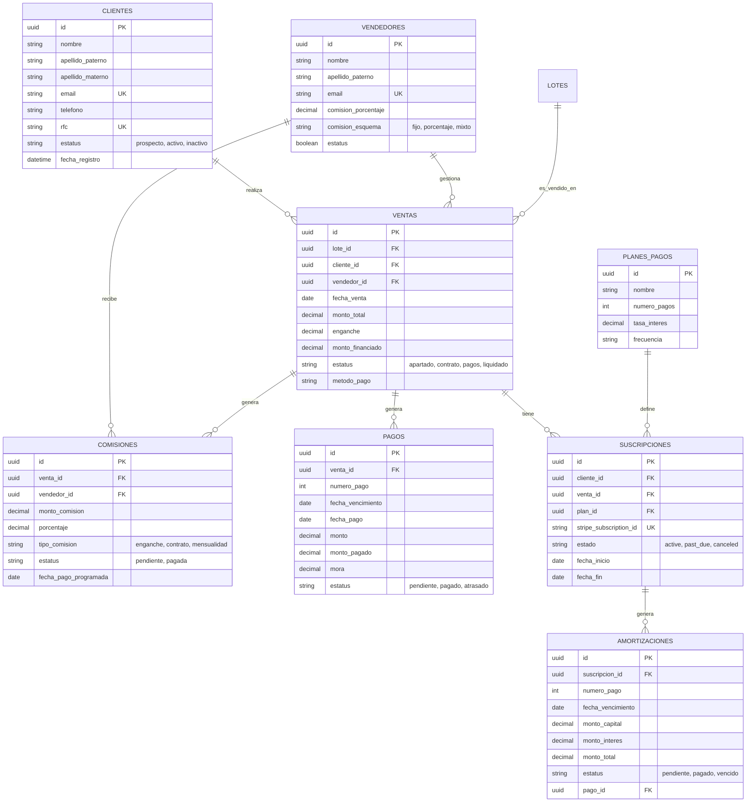

# Esquema de Base de Datos - ERP Inmobiliario

## Diagramas ERD

### Diagrama Completo (Mermaid)



## Colecciones

### clientes

Almacena la información de prospectos y clientes reales.

- **Campos:**
  - `id` (UUID, PK): Identificador único.
  - `nombre` (String, required): Nombre(s) del cliente.
  - `apellido_paterno` (String, required): Apellido paterno.
  - `apellido_materno` (String): Apellido materno.
  - `email` (String, Unique, required): Correo electrónico.
  - `rfc` (String, Unique, required): RFC para facturación.
  - `estatus` (String, Enum): `prospecto`, `activo`, `inactivo`. Default: `prospecto`.
- **Índices:**
  - `email_unique`: `[email]`
  - `rfc_unique`: `[rfc]`
- **Relaciones:**
  - `ventas`: One-to-Many con la colección `ventas`.
- **Validaciones:**
  - Email válido.
  - RFC con formato correcto.

### vendedores

Personal de ventas y comisionistas externos.

- **Campos:**
  - `id` (UUID, PK): Identificador único.
  - `nombre` (String, required): Nombre completo.
  - `email` (String, Unique, required): Correo de contacto.
  - `comision_porcentaje` (Decimal): Porcentaje base de comisión.
  - `estatus` (Boolean): `true` (Activo), `false` (Inactivo).
- **Índices:**
  - `email_unique`: `[email]`
- **Relaciones:**
  - `ventas`: One-to-Many.
  - `comisiones`: One-to-Many.

### ventas

Tabla pivote central que vincula operaciones.

- **Campos:**
  - `id` (UUID, PK): Identificador único.
  - `lote_id` (UUID, FK): Referencia al lote (inventario).
  - `cliente_id` (UUID, FK): Referencia al cliente.
  - `vendedor_id` (UUID, FK): Referencia al vendedor.
  - `monto_total` (Decimal): Valor total de la operación.
  - `enganche` (Decimal): Monto inicial.
  - `monto_financiado` (Decimal): `monto_total - enganche`.
  - `plazo_meses` (Int): Número de mensualidades.
  - `estatus` (String, Enum): `apartado`, `contrato`, `pagos`, `liquidado`, `cancelada`.
- **Relaciones:**
  - `lote`: Many-to-One.
  - `cliente`: Many-to-One.
  - `vendedor`: Many-to-One.
  - `pagos`: One-to-Many (Cascade Delete).

### pagos

Tabla de amortización y registro de ingresos.

- **Campos:**
  - `id` (UUID, PK): Identificador único.
  - `venta_id` (UUID, FK): Referencia a la venta.
  - `numero_pago` (Int): Número consecutivo de la mensualidad.
  - `fecha_vencimiento` (Date): Fecha límite de pago.
  - `monto` (Decimal): Monto programado.
  - `monto_pagado` (Decimal): Monto real pagado.
  - `mora` (Decimal): Monto por penalización.
  - `estatus` (String, Enum): `pendiente`, `pagado`, `atrasado`.
- **Relaciones:**
  - `venta`: Many-to-One.

### comisiones

Registro de pasivos de la empresa hacia los vendedores.

- **Campos:**
  - `id` (UUID, PK): Identificador único.
  - `venta_id` (UUID, FK).
  - `vendedor_id` (UUID, FK).
  - `monto_comision` (Decimal).
  - `estatus` (String, Enum): `pendiente`, `pagada`.

### planes_pagos

Catálogo de planes de financiamiento disponibles.

- **Campos:**
  - `id` (UUID, PK).
  - `nombre` (String, required): Nombre comercial del plan.
  - `tasa_interes` (Decimal): Tasa anual.
  - `numero_pagos` (Int): Plazo en meses.
  - `monto_inicial` (Decimal): Enganche mínimo requerido.
  - `activo` (Boolean).

### suscripciones

Gestiona la recurrencia de pagos a través de Stripe.

- **Campos:**
  - `id` (UUID, PK).
  - `cliente_id` (UUID, FK).
  - `venta_id` (UUID, FK).
  - `plan_id` (UUID, FK).
  - `stripe_subscription_id` (String): ID externo de Stripe.
  - `estado` (String, Enum): `active`, `past_due`, `canceled`.
  - `fecha_inicio` (Date).
  - `fecha_fin` (Date).

### amortizaciones

Detalle financiero de cada pago dentro de una suscripción.

- **Campos:**
  - `id` (UUID, PK).
  - `suscripcion_id` (UUID, FK).
  - `numero_pago` (Int).
  - `monto_capital` (Decimal).
  - `monto_interes` (Decimal).
  - `estatus` (String, Enum).

## Triggers

En esta arquitectura basada en Directus, los "triggers" se implementan principalmente como Hooks de Lógica de Negocio (Directus Actions) o dentro de los Custom Endpoints.

1.  **Creación de Tabla de Amortización:**
    - **Disparador:** `POST /ventas` (Creación exitosa de venta).
    - **Acción:** Genera N registros en la colección `pagos` calculando fechas y montos.
    - **Ubicación:** `extensions/endpoints/ventas/src/index.js`.

2.  **Actualización de Estatus de Venta (Liquidación):**
    - **Disparador:** `POST /pagos` (Pago registrado).
    - **Acción:** Verifica si `SUM(monto_pagado) >= monto_total`. Si es así, actualiza `venta.estatus` a `liquidado`.
    - **Ubicación:** `extensions/endpoints/pagos/src/index.js`.

3.  **Cálculo Automático de Mora:**
    - **Disparador:** `POST /pagos` (Al intentar pagar).
    - **Acción:** Si `fecha_actual > fecha_vencimiento`, aplica 5% de mora sobre el monto de la mensualidad.
    - **Ubicación:** `extensions/endpoints/pagos/src/index.js`.

## Migraciones

Las migraciones se gestionan mediante scripts SQL y la sincronización de esquema de Directus.

### Script Inicial (Ejemplo)

`database/migrations/001_create_crm_schema.sql`

```sql
CREATE TABLE clientes (
    id CHAR(36) PRIMARY KEY,
    nombre VARCHAR(255) NOT NULL,
    email VARCHAR(255) UNIQUE NOT NULL,
    -- ...
);
-- (Scripts completos disponibles en repositorio de migraciones)
```

### Datos de Prueba (Seeds)

Se recomienda usar el endpoint `/utils/seed` (si está habilitado en desarrollo) para poblar datos iniciales de catálogos.
