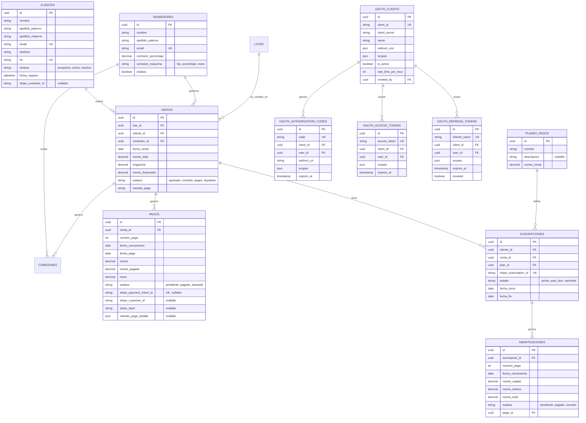

# Diseño de Base de Datos - Módulo CRM y Ventas (Fase 2)

**Versión:** 1.0.0
**Fecha:** 30 Enero 2026
**Responsable:** Database Agent Warrior

## 1. Diagrama Entidad-Relación (ERD)

## 2. Descripción de Tablas

### Módulo Clientes

- **clientes**: Almacena la información personal y de contacto de los clientes potenciales y reales. Se vincula con Stripe Customer.

### Módulo Ventas

- **ventas**: Registro central de la operación de venta. Vincula un lote con un cliente y un vendedor.
- **lotes**: (Referencia) Inventario de terrenos disponibles.
- **vendedores**: Agentes encargados de la venta.

### Módulo Financiero

- **pagos**: Registro individual de cada pago realizado o programado.
- **planes_pagos**: Definición de esquemas de financiamiento.
- **suscripciones**: Manejo de pagos recurrentes vía Stripe.
- **amortizaciones**: Desglose de pagos de capital e intereses.

### Módulo Seguridad (OAuth 2.0)

- **oauth_clients**: Aplicaciones de terceros registradas para acceder a la API.
- **oauth_authorization_codes**: Códigos temporales para el flujo de autorización.
- **oauth_access_tokens**: Tokens de acceso (JWT) para autenticar peticiones.
- **oauth_refresh_tokens**: Tokens de larga duración para renovar el acceso.
