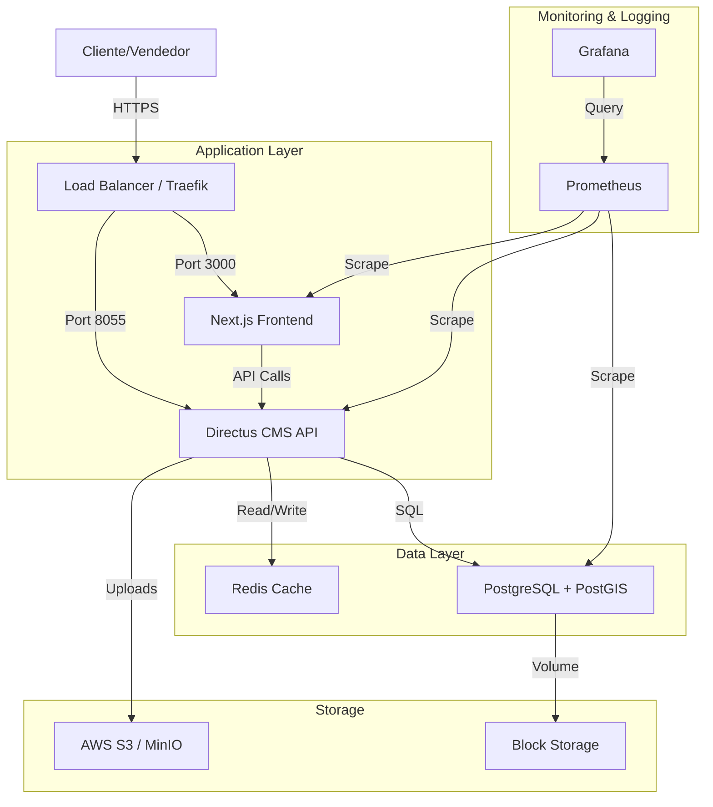

# Plan Maestro de Infraestructura y DevOps

## 1. Análisis de Requisitos

### Estado Actual

- **Frontend**: Next.js 14 (SSR/CSR), React 18, TypeScript.
- **Backend**: Directus Headless CMS (Node.js).
- **Base de Datos**: PostgreSQL + PostGIS (Geospatial data).
- **Caché**: Redis (necesario para Directus caching y colas).
- **Infraestructura**: Despliegue manual, sin CI/CD formal.

### Requerimientos Críticos

- **Alta Disponibilidad**: El CRM gestiona ventas y pagos críticos.
- **Seguridad**: Datos sensibles de clientes y financieros.
- **Escalabilidad**: Crecimiento de lotes y usuarios concurrentes.
- **Observabilidad**: Logs centralizados y métricas de rendimiento.

## 2. Arquitectura Propuesta

### Diagrama de Arquitectura (Docker Swarm / K8s Ready)



## 3. Configuración de Servicios

La infraestructura se define como código (IaC) utilizando **Docker Compose** para orquestación local/simple y preparación para orquestadores mayores.

### Componentes Clave

- **Frontend**: Contenerizado con Docker (Multi-stage build).
- **Directus**: Imagen oficial extendida con volúmenes para extensiones.
- **Postgres**: Imagen oficial con PostGIS preinstalado.
- **Redis**: Alpine version para ligereza.

## 4. Pipeline de CI/CD

Implementado con **GitHub Actions**.

### CI (Continuous Integration) - `.github/workflows/ci.yml`

- Se ejecuta en cada Push/PR a `main` o `develop`.
- **Frontend Check**: Instala dependencias, ejecuta Linter, Type Check y Unit Tests.
- **Build Check**: Verifica que la imagen de Docker se construya correctamente sin errores.

### CD (Continuous Deployment) - `.github/workflows/cd.yml`

- Se ejecuta al crear un tag `v*`.
- **Build & Push**: Construye imágenes Docker optimizadas y las sube al Registry (Docker Hub / ECR).
- **Deploy**: Conecta vía SSH al servidor de producción y actualiza los servicios con `docker-compose up -d`.

## 5. Configuración de Monitoring y Alerting

### Stack Implementado

- **Prometheus**: Recolección de métricas (CPU, RAM, Request Latency).
- **Grafana**: Visualización de dashboards.
- **Node Exporter**: Métricas del host.
- **cAdvisor**: Métricas de contenedores.

### Alertas Críticas (Propuesta)

- **High CPU/Memory**: > 80% por 5 min.
- **Site Down**: Frontend/Backend no responden (Healthcheck failure).
- **Disk Space**: < 10% libre.
- **Database Connections**: > 90% del límite.

## 6. Estrategia de Backup y Disaster Recovery

### Política de Backups

1.  **Base de Datos (PostgreSQL)**:
    - **Full Backup Diari**: Dump completo a S3 a las 02:00 AM.
    - **WAL Archiving**: Continuo para Point-in-Time Recovery (PITR).
2.  **Uploads (Directus)**:
    - Sincronización diaria a S3 (o uso directo de driver S3).

### Disaster Recovery (DR)

- **RTO (Recovery Time Objective)**: < 1 hora.
- **RPO (Recovery Point Objective)**: < 15 minutos.
- **Procedimiento**:
  1.  Provisionar nuevo servidor/cluster.
  2.  Restaurar volúmenes de datos desde S3.
  3.  Desplegar stack Docker con `docker-compose`.
  4.  Cambiar DNS.

## 7. Estimación de Costos (Mensual - Escenario Cloud VPS)

| Servicio               | Especificación             | Costo Aprox (USD) |
| :--------------------- | :------------------------- | :---------------- |
| **Compute (VPS)**      | 4 vCPU, 8GB RAM (Prod)     | $40 - $60         |
| **Database (Managed)** | Opcional: Managed Postgres | $30 - $60         |
| **Storage**            | 100GB Block Storage + S3   | $10 - $15         |
| **Load Balancer**      | Cloud LB                   | $10 - $20         |
| **Total Estimado**     |                            | **$90 - $155**    |

_Nota: Usando Docker en un VPS grande (DigitalOcean Droplet / AWS EC2) se reducen costos vs servicios gestionados individuales._

## 8. Runbooks y Playbooks

### 🔧 Runbook: Despliegue Manual (Hotfix)

En caso de fallo del CI/CD:

```bash
# 1. Conectar al servidor
ssh user@production-server

# 2. Navegar al directorio
cd /opt/quintas-crm

# 3. Traer cambios
git pull origin main

# 4. Reconstruir y reiniciar solo el servicio afectado
docker-compose up -d --build --no-deps frontend
```

### 🚑 Runbook: Restauración de Base de Datos

```bash
# 1. Detener aplicación
docker-compose stop directus frontend

# 2. Copiar backup al contenedor (o volumen)
cat backup_2026_02_02.sql | docker exec -i quintas_postgres psql -U postgres quintas_crm

# 3. Reiniciar servicios
docker-compose start
```

### 🔍 Runbook: Debugging Logs

```bash
# Ver logs en tiempo real de todos los servicios
docker-compose logs -f --tail=100

# Ver logs específicos del backend buscando errores
docker-compose logs directus | grep "Error"
```
