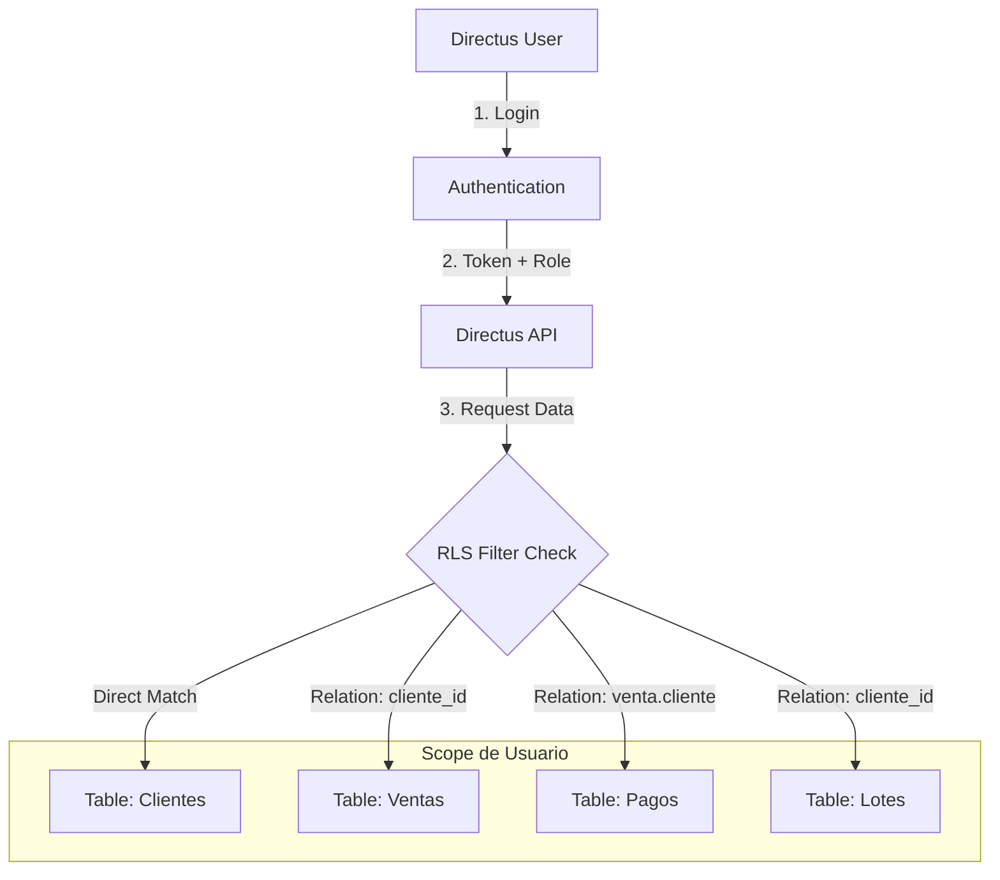

# Roles y Permisos - Quintas de Otinapa ERP

## Descripción General

Este documento define la matriz de seguridad y los controles de acceso implementados en Directus para el ERP inmobiliario. El enfoque principal es **Row-Level Security (RLS)** para garantizar que los clientes externos solo accedan a su propia información.

## Roles del Sistema

| Rol               | ID (UUID)                              | Descripción                          | Acceso Admin |
| :---------------- | :------------------------------------- | :----------------------------------- | :----------- |
| **Administrador** | (Nativo)                               | Acceso total al sistema              | Sí           |
| **Cliente**       | `8704c7c8-8924-4246-9214-727500c283c7` | Acceso limitado a portal de clientes | No           |

---

## Matriz de Permisos (Rol: Cliente)

### 1. Colección `clientes`

- **Acceso**: Lectura Parcial, Edición Limitada.
- **Regla RLS**: El usuario de Directus debe coincidir con el campo `user_id` del cliente.
  ```json
  {
    "user_id": { "_eq": "$CURRENT_USER" }
  }
  ```
- **Campos Permitidos (Update)**: `telefono`, `email`.
- **Campos Permitidos (Read)**: Todos (\*).

### 2. Colección `ventas`

- **Acceso**: Solo Lectura.
- **Regla RLS**: Acceso a ventas donde el cliente asociado es el usuario actual.
  ```json
  {
    "cliente_id": {
      "user_id": { "_eq": "$CURRENT_USER" }
    }
  }
  ```

### 3. Colección `pagos`

- **Acceso**: Solo Lectura.
- **Regla RLS**: Acceso a pagos de ventas asociadas al usuario actual.
  ```json
  {
    "venta_id": {
      "cliente_id": {
        "user_id": { "_eq": "$CURRENT_USER" }
      }
    }
  }
  ```

### 4. Colección `lotes`

- **Acceso**: Solo Lectura.
- **Regla RLS**: Solo puede ver los lotes que ha comprado (asignados a su registro de cliente).
  ```json
  {
    "cliente_id": {
      "user_id": { "_eq": "$CURRENT_USER" }
    }
  }
  ```

### 5. Colección `directus_files` (Documentos)

- **Acceso**: Solo Lectura.
- **Regla RLS**: Puede ver archivos que él subió O archivos etiquetados con su ID de cliente.
  ```json
  {
    "_or": [
      { "uploaded_by": { "_eq": "$CURRENT_USER" } },
      { "cliente_id": { "user_id": { "_eq": "$CURRENT_USER" } } }
    ]
  }
  ```

---

## Diagrama de Flujo de Datos RLS



## Instrucciones Operativas

### Crear Nuevo Cliente con Acceso al Portal

1.  **Crear Usuario en Directus**:
    - Ir a Configuración -> Usuarios.
    - Crear usuario con email del cliente.
    - Asignar rol **"Cliente"**.
    - Establecer contraseña temporal.

2.  **Crear Registro de Cliente (CRM)**:
    - Ir a módulo Clientes.
    - Llenar datos personales.
    - **IMPORTANTE**: En el campo `user_id` (Usuario de Sistema), seleccionar el usuario creado en el paso 1.

3.  **Verificación**:
    - El cliente puede iniciar sesión en el portal.
    - Solo verá sus datos, ventas y pagos.

### Troubleshooting Común

- **Error 403 Forbidden**: Verificar que el `user_id` en la tabla `clientes` coincida con el usuario logueado.
- **No se ven documentos**: Asegurar que el archivo tenga el campo `cliente_id` lleno o haya sido subido por el usuario.
